#. Encrypted Traffic Analytics

December 2017

#. Table of Contents

`Network as a Sensor with Encrypted Traffic Analytics
1 <#_Toc499557847>`__

`Table of Contents 2 <#_Toc499557848>`__

`Introduction 4 <#_Toc499557849>`__

`Design Overview 4 <#_Toc499557850>`__

`Crypto Audit 5 <#_Toc499557851>`__

`Malware Detection 5 <#_Toc499557852>`__

`Assumptions 7 <#_Toc499557853>`__

`Components at a Glance 7 <#_Toc499557854>`__

`NetFlow 7 <#_Toc499557855>`__

`Cisco Stealthwatch 8 <#_Toc499557856>`__

`Cognitive Threat Analytics 8 <#_Toc499557857>`__

`Encrypted Traffic Analytics 8 <#_Toc499557858>`__

`Cisco Catalyst 9300 Series Switches 8 <#_Toc499557859>`__

`Cisco Catalyst 9400 Series Switches 9 <#_Toc499557860>`__

`Use Cases 10 <#_Toc499557861>`__

`Crypto Audit and Malware Detection in Encrypted Traffic
10 <#_Toc499557862>`__

`Healthcare Use Case 10 <#_Toc499557863>`__

`Retail PCI Use Case 14 <#_Toc499557864>`__

`Deployment Considerations 19 <#_Toc499557865>`__

`Enabling ETA and Flexible NetFlow in Campus Networks
19 <#_Toc499557866>`__

`ETA and NetFlow Timers 21 <#_Toc499557867>`__

`Catalyst 9300 and 9400 Series Switch ETA and FNF Support
21 <#_Toc499557868>`__

`Enabling ETA and Flexible NetFlow on Routers at the edge and in WAN
Branch Networks 23 <#_Toc499557869>`__

`ETA and NetFlow Timers 24 <#_Toc499557870>`__

`Router ETA and FNF Support 25 <#_Toc499557871>`__

`Branch Use Cases 25 <#_Toc499557872>`__

`Configuration: 27 <#_Toc499557873>`__

`Configuration: 29 <#_Toc499557874>`__

`Configuration: 30 <#_Toc499557875>`__

`Configuration: 32 <#_Toc499557876>`__

`Configuration: 34 <#_Toc499557877>`__

`Deployment Details 34 <#_Toc499557878>`__

`Integrating Cognitive Threat Analytics with Stealthwatch
35 <#_Toc499557879>`__

`Configuring the Catalyst 9300 40 <#_Toc499557880>`__

`Configuring the ISR4000 and ASR1000 Family of Routers
44 <#_Toc499557881>`__

`Stealthwatch Management Console and Cognitive Threat Analytics User
Interface for Crypto Audit and Malware Detection 49 <#_Toc499557882>`__

`Appendix A: Product List for NaaS 2.0 with ETA 62 <#_Toc499557883>`__

`Stealthwatch 62 <#_Toc499557884>`__

`LAN Access Layer 62 <#_Toc499557885>`__

`Appendix B: Requirements for enabling ETA 64 <#_Toc499557886>`__

`Appendix C: References 65 <#_Toc499557887>`__

#. Introduction

The rapid rise in encrypted traffic is changing the threat landscape. As
more businesses become digital, a significant number of services and
applications are using encryption as the primary method of securing
information. More specifically, encrypted traffic has increased by more
than 90 percent annually, with more than 40 percent of web sites
encrypting traffic in 2016 versus 21 percent in 2015.

Encryption technology has enabled much greater privacy and security for
enterprises and individuals that use the Internet to communicate and
transact business online. Mobile, cloud and web applications rely on
well-implemented encryption mechanisms that use keys and certificates to
ensure security and trust. However, businesses are not the only ones to
benefit from encryption. Threat actors have leveraged these same
benefits to evade detection and to secure their malicious activities.

Traditional flow monitoring, as implemented in the Cisco® Network as a
Sensor (NaaS) solution and through the use of NetFlow, provides a
high-level view of network communications by reporting the addresses,
ports, and byte and packet counts of a flow. In addition, *intraflow
metadata*, or information about events that occur inside of a flow, can
be collected, stored, and analyzed within a flow monitoring framework.
This data is especially valuable when traffic is encrypted, because
deep-packet inspection is no longer viable. This intraflow metadata,
called *Encrypted Traffic Analytics* (ETA), is derived by using new data
elements or telemetry that are independent of protocol details, such as
the lengths and arrival times of packets within a flow. These data
elements have the property of applying equally well to both encrypted
and unencrypted flows.

ETA focuses on identifying malware communications in encrypted traffic
through passive monitoring, the extraction of relevant data elements,
and supervised machine learning with cloud based global visibility.

ETA extracts three main data elements: the initial data packet, the
sequence of packet length and times, and TLS-specific features.

Reader Tip

For more information about Encrypted Traffic Analytics, see the complete
`ETA
Whitepaper <https://www.cisco.com/c/dam/en/us/solutions/collateral/enterprise-networks/enterprise-network-security/nb-09-encrytd-traf-anlytcs-wp-cte-en.pdf>`__.

#. Design Overview

This guide describes how to enable NaaS with ETA, providing both
cryptographic assessment of the cipher suites used for TLS encrypted
communications as well as the ability to identify malicious traffic
patterns with the encrypted traffic of users in both campus and branch
networks. This CVD discusses the use of Cisco Stealthwatch version 6.9.2
when integrated with Cisco Cognitive Threat Analytics (CTA) in passively
monitoring encrypted endpoint and server traffic traversing Cisco
Catalyst 9300/9400 series switches or IOS-XE based routers, such as the
Cisco ASR 1000,ISR 4000, ISRv, and CSR 1000v supporting ETA and Flexible
NetFlow (FNF).

Cisco NaaS provides deeper visibility into the network by leveraging
Flexible NetFlow on switches, routers and wireless LAN controllers
(WLCs). When leveraging Cisco Identity Services Engine (ISE), pxGrid,
TrustSec, and Cisco Stealthwatch, NaaS can additionally quarantine
attacks.

With the release of Cisco IOS-XE 16.6.2 for Catalyst 9300/9400 switches
and the ASR1K/ISR4K/ISRv/CSR, the NaaS Solution deployed with
Stealthwatch 6.9.2 and integrated with Cognitive Threat Analytics is now
extended, through the introduction of Encrypted Traffic Analytics, to
include the ability to conduct cryptographic assessment or crypto audit
as well as malware detection of TLS or SSL encrypted traffic.

Tech Tip

As of IOS-XE 16.6.2, the Cisco 1100 router also supports ETA; however,
it was not tested for inclusion in this CVD.

#. Flexible NetFlow and ETA

Although it is possible to just configure ETA, it is necessary to also
configure FNF for analysis of encrypted traffic in the Cognitive Threat
Analytics cloud for malware detection as ETA only sends information
about the IDP and SPLT collected and processed by the switch. For full
NetFlow statistics containing connection and peer information such as
number of bytes, packet rates, round trip times, and so on, you must
also configure FNF. For the singular purpose of performing a crypto
audit, however, it is only necessary to enable ETA on the switch.

The following tables depicting the IDP and SPLT templates list those
NetFlow key and non-key fields included in the exported record when ETA
is enabled. As you can see, this is a small subset of the data elements
that can be collected via FNF and thus the reason for configuring both
ETA and FNF.

1. IDP template

+---------------------------------+-----------------+-------------------------+
| **Information element**         | **Flow key?**   | **NetFlow V9 length**   |
+=================================+=================+=========================+
| sourceIPv4Address               | Y               | 4                       |
|                                 |                 |                         |
| (sourceIPv6Address)             |                 | (16)                    |
+---------------------------------+-----------------+-------------------------+
| destinationIPv4Address          | Y               | 4                       |
|                                 |                 |                         |
| (destinationIPv6Address)        |                 | (16)                    |
+---------------------------------+-----------------+-------------------------+
| sourceTransportPort             | Y               | 2                       |
+---------------------------------+-----------------+-------------------------+
| destinationTransportPort        | Y               | 2                       |
+---------------------------------+-----------------+-------------------------+
| protocolIdentifier              | Y               | 1                       |
+---------------------------------+-----------------+-------------------------+
| flowStartSysUpTime              | N               | 4                       |
+---------------------------------+-----------------+-------------------------+
| flowEndSysUpTime                | N               | 4                       |
+---------------------------------+-----------------+-------------------------+
| packetDeltaCount                | N               | 8                       |
+---------------------------------+-----------------+-------------------------+
| octetDeltaCount                 | N               | 8                       |
+---------------------------------+-----------------+-------------------------+
| initialDataPacket (v9), or      | N               | 1300                    |
|                                 |                 |                         |
| ipHeaderPacketSection (IPFIX)   |                 |                         |
+---------------------------------+-----------------+-------------------------+

1. SPLT template

+-----------------------------------------------+-----------------+-------------------------+
| **Information element**                       | **Flow key?**   | **NetFlow V9 length**   |
+===============================================+=================+=========================+
| sourceIPv4Address                             | Y               | 4                       |
|                                               |                 |                         |
| (sourceIPv6Address)                           |                 | (16)                    |
+-----------------------------------------------+-----------------+-------------------------+
| destinationIPv4Address                        | Y               | 4                       |
|                                               |                 |                         |
| (destinationIPv6Address)                      |                 | (16)                    |
+-----------------------------------------------+-----------------+-------------------------+
| sourceTransportPort                           | Y               | 2                       |
+-----------------------------------------------+-----------------+-------------------------+
| destinationTransportPort                      | Y               | 2                       |
+-----------------------------------------------+-----------------+-------------------------+
| protocolIdentifier                            | Y               | 1                       |
+-----------------------------------------------+-----------------+-------------------------+
| flowStartSysUpTime                            | N               | 4                       |
+-----------------------------------------------+-----------------+-------------------------+
| flowEndSysUpTime                              | N               | 4                       |
+-----------------------------------------------+-----------------+-------------------------+
| packetDeltaCount                              | N               | 8                       |
+-----------------------------------------------+-----------------+-------------------------+
| octetDeltaCount                               | N               | 8                       |
+-----------------------------------------------+-----------------+-------------------------+
| Sequence of Packet Lengths and Times (SPLT)   | N               | 40                      |
+-----------------------------------------------+-----------------+-------------------------+

Reader Tip

A complete list of the unique data elements provided in ETA records can
be found in Appendix A

#. Crypto Audit

*Crypto audit* is the capability of viewing/reporting and eventually
alerting and alarming on the crypto fields in the Stealthwatch database.
The crypto audit functionality provides detailed information about the
cipher suites used for TLS communications, including the encryption
version, key exchange, key length, cipher suite, authentication
algorithm, and hash used.

With the crypto audit functionality enabled by ETA, the unencrypted
metadata in the Client Hello and Client Key Exchange messages provides
information that can be used to make inferences about the client's
Transport Layer Security (TLS) library and the cipher suites used. The
collection of this information begins with the *initial data packet*
(IDP), or first packet of the flow, and continues through subsequent
messages comprising the TLS handshake. This data is then exported by the
device via NetFlow and collected at the Stealthwatch Flow Collector
(FC). Once collected, these records can be queried by Stealthwatch
Management Console (SMC) for analysis.

These flow records can be collected by a Stealthwatch Flow Collector
over a period of time and subsequently filtered, searched through, and
reported on at the Stealthwatch Management Console for auditing purposes
ensuring that the most secure cipher suites are used to secure
confidential information as well as providing evidence of regulatory
compliance.

#. Malware Detection

When implementing ETA, in addition to cryptographic assessment, the
metadata collected can also be used to detect malware within the
encrypted traffic without the need to decrypt the traffic when Cisco
Stealthwatch is integrated with Cognitive Threat Analytics. When
combining Flexible NetFlow and DNS information along with the ETA
metadata found in the IDP, other ETA data elements such as Sequence of
Packet Length and Times (SPLT) provide a unique and valuable means for
identifying malware through the detection of suspicious traffic.

SPLT telemetry is composed of a set of two parameters describing each of
the first 10 packets of a flow—the length of the application payload in
that packet and the inter-arrival time from the previous packet. Only
packets that carry some application payload are considered; the rest
(such as SYN or SYN/ACK) are ignored. The SPLT provides visibility
beyond the first packet of the encrypted flows. The analysis of the
metadata contained in the IDP and SPLT greatly enhance the accuracy of
malware detection in the Cognitive Threat Analytics cloud.

Although all endpoint traffic is monitored and records exported to the
Stealthwatch Flow Collectors, by default, only traffic crossing the
enterprise network perimeter (i.e., Internet-bound) and outside of the
enterprise address space as well as all DNS queries regardless of
domain, are sent by the Stealthwatch flow collector to the CTA cloud for
further analysis. All communications between the flow collector and the
CTA cloud as well as from the CTA cloud to the SMC is sent in an
encrypted TLS tunnel as seen below.

1. ETA malware detection in Cognitive Threat Analytics cloud

|image0|\ **7128F**

ETA and FNF records for TLS-encrypted endpoint traffic destined
internally to other endpoints or servers within the organization's
internal address space are not sent to the Cognitive Threat Analytics
cloud for further inspection. However, with the combined ETA and FNF
records, cryptographic assessment can still be performed on these flows.

Tech Tip

The enterprise address space (as identified by internal IP addresses or
**Inside Hosts** as defined in Stealthwatch) are administered through
the Host Groups settings within the SMC. By default, a Catch All host
group is defined and consists of the RFC1918 address space. For more
information, see "Deployment," later in this document.

After integration of Stealthwatch and CTA, FNF and ETA fields are
immediately sent to the CTA cloud for analysis. Initially, there will be
a brief "training" period in which analysis results may not be displayed
at the SMC. This is completely normal.

Once this initial period of a day or two is complete, CTA analyzes the
new encrypted traffic data elements within the ETA records by applying
machine learning and statistical modeling with existing classifiers. The
global risk map and Encrypted Traffic Analytics data elements reinforce
each other in the Cognitive Threat Analytics engine. Rather than
decrypting the traffic, Stealthwatch with Cognitive Threat Analytics
uses machine-learning algorithms to pinpoint malicious patterns such as
data exfiltration in encrypted traffic to help identify threats and
improve incident response times.

Tech Tip

Cisco Cognitive Threat Analytics processes the ETA and NetFlow data in a
dedicated data center. Deployment is aligned on the security and data
governance principles applied in production and complies with Cisco
cloud-operations standards regulating security and privacy attributes.
Input data is typically processed within 2 to 4 hours and is stored for
seven days after which it is automatically deleted.

#. Assumptions

This guide assumes that Stealthwatch components have been installed and
configured. You should use this guide along with the `Network as a
Sensor with Stealthwatch and Stealthwatch Learning Networks for Threat
Visibility and Defense Deployment
Guide <https://cvddocs.com/fw/220-17a>`__.

Additionally, and beyond the scope of this guide, the NaaS with
Stealthwatch guide discusses Stealthwatch integration with ISE, which
can be used to profile devices and provide identity based policy and
networking services supporting software-defined segmentation through
Cisco TrustSec and Cisco Rapid Threat Containment for quarantine of
suspicious traffic.

Reader Tip

For more information about related technologies, see the web pages `for
Cisco Cyber Threat
Defense <https://www.cisco.com/c/en/us/support/security/cyber-threat-defense-2-0/model.html>`__,
`Cisco Rapid Threat
Containment <http://www.cisco.com/c/en/us/solutions/enterprise-networks/rapid-threat-containment/index.html>`__,
and `Cisco TrustSec <http://www.cisco.com/go/trustsec>`__.

#. Components at a Glance

#. NetFlow

NetFlow is a standard that defines data elements exported by network
devices that describe the "conversations" on the network. NetFlow is
uni-directional, and each device on the network can export different
NetFlow data elements. When processed, NetFlow data can tell you the
important details in network transactions' endpoints of data
communication, information about when the conversation occurred, how
long it lasted, and what protocols were used. It is a Layer 3 (possibly
Layer 2, based on where it's enabled or match conditions) network
protocol, which you can easily enable on wired and wireless devices for
visibility into the network flows, as well as enhanced network anomaly
and malware detection.

1. NetFlow operation on a network device

|C:\\\_VSS local files\\AOB Art\\Flattened\\PNG
versions\\6010F.png|\ **6010F**

For more information, see the `Cisco IOS
NetFlow <http://www.cisco.com/c/en/us/products/ios-nx-os-software/ios-netflow/index.html>`__
web page.

#. Cisco Stealthwatch

Cisco Stealthwatch harnesses the power of network telemetry—including
but not limited to NetFlow, IPFIX, proxy logs, and deep packet
inspection on raw packets—in order to provide advanced network
visibility, security intelligence, and analytics. This visibility allows
a Stealthwatch database record to be maintained for every communication
that traverses a network device. This aggregated data can be analyzed in
order to identify hosts with suspicious patterns of activity.
Stealthwatch has different alarm categories using many different
algorithms watching behavior and identifying suspicious activity.
Stealthwatch leverages NetFlow data from network devices throughout all
areas of the network—access, distribution, core, data center, and
edge—providing a concise view of normal traffic patterns throughout and
alerting when policies defining abnormal behavior are matched.

For more information, see the `Cisco
Stealthwatch <http://www.cisco.com/go/stealthwatch>`__ web page.

#. Cognitive Threat Analytics

Cisco Cognitive Threat Analytics finds malicious activity that has
bypassed security controls or entered through unmonitored channels
(including removable media) and is operating inside an organization’s
environment. Cognitive Threat Analytics is a cloud-based product that
uses machine learning and statistical modeling of networks. It creates a
baseline of the traffic in your network and identifies anomalies. It
analyzes user and device behavior and web traffic in order to discover
command-and-control communications, data exfiltration, and potentially
unwanted applications operating in your infrastructure

For more information, see the `Cisco Cognitive Threat
Analytics <https://www.cisco.com/c/en/us/products/security/cognitive-threat-analytics/index.html>`__
web page.

#. Encrypted Traffic Analytics

Encrypted Traffic Analytics is an IOS-XE feature that uses advanced
behavioral algorithms to identify malicious traffic patterns through
analysis of intraflow metadata of encrypted traffic, detecting potential
threats hiding in encrypted traffic.

For more information, see the `Cisco Encrypted Traffic
Analytics <https://www.cisco.com/c/dam/en/us/solutions/collateral/enterprise-networks/enterprise-network-security/nb-09-encrytd-traf-anlytcs-wp-cte-en.pdf>`__
web page.

#. Cisco Catalyst 9300 Series Switches

The Cisco Catalyst 9300 series switches are Cisco’s lead stackable
enterprise switching platform built for security, Internet of Things
(IoT), mobility, and cloud. They are the next generation of the
industry’s most widely deployed switching platform. The Catalyst 9300
Series switches form the foundational building block for
Software-Defined Access (SD-Access), Cisco’s lead enterprise
architecture.

At 480 Gbps, they are the industry’s highest-density stacking bandwidth
solution with the most flexible uplink architecture. The Catalyst 9300
Series is the first optimized platform for high-density 802.11ac Wave2.
It sets new maximums for network scale.

These switches are also ready for the future, with an x86 CPU
architecture and more memory, enabling them to host containers and run
third-party applications and scripts natively within the switch. The
switches are based on the Cisco Unified Access Data Plane 2.0 (UADP) 2.0
architecture, which not only protects your investment but also allows a
larger scale and higher throughput as well as enabling Encrypted Traffic
Analytics.

For more information, see the `Catalyst 9300 Series
Switches <https://www.cisco.com/c/en/us/products/switches/catalyst-9300-series-switches/index.html>`__
web page.

#. Cisco Catalyst 9400 Series Switches

The Cisco Catalyst 9400 Series switches are Cisco’s leading modular
enterprise access switching platform built for security, IoT and cloud.
The platform provides unparalleled investment protection with a chassis
architecture that is capable of supporting up to 9 Tbps of system
bandwidth and unmatched power delivery for high density IEEE 802.3BT
(60W PoE).

The Catalyst 9400 delivers state-of-the-art high availability with
capabilities such as uplink resiliency and N+1/N+N redundancy for power
supplies. The platform is enterprise-optimized with an innovative
dual-serviceable fan tray design and side-to-side airflow and is
closet-friendly with ~16” depth.

A single system can scale up to 384 access ports with your choice of 1G
copper UPoE and PoE+ options. The platform also supports advanced
routing and infrastructure services, SD-Access capabilities, and network
system virtualization. These features enable optional placement of the
platform in the core and aggregation layers of small to medium-sized
campus environments.

For more information, see the `Catalyst 9400 Series
Switch <https://www.cisco.com/c/en/us/products/switches/catalyst-9400-series-switches/datasheet-listing.html>`__
web page.

#. Cisco Cloud Services 1000v Router

The Cisco Cloud Services Router 1000v (CSR 1000v) is a
virtual-form-factor router that delivers comprehensive WAN gateway and
network services functions into virtual and cloud environments. Using
familiar, industry-leading Cisco IOS XE Software networking
capabilities, the CSR 1000v enables enterprises to transparently extend
their WANs into provider-hosted clouds. Similarly, cloud providers
themselves can use it to offer enterprise-class networking services to
their tenants or customers.

For more information see the `Cisco Cloud Services
Router <https://www.cisco.com/c/en/us/products/routers/cloud-services-router-1000v-series/index.html#~stickynav=1>`__
web page.

#. Cisco Integrated Services Virtual Router

The Cisco Integrated Services Virtual Router (ISRv) is a virtual
form-factor Cisco IOS XE Software router that delivers comprehensive WAN
gateway and network services functions into virtual environments. Using
familiar, industry-leading Cisco IOS XE Software networking capabilities
(the same features present on Cisco 4000 Series ISRs and ASR 1000 Series
physical routers), the Cisco ISRv enables enterprises to deliver WAN
services to their remote locations using the Cisco Enterprise Network
Functions Virtualization (Enterprise NFV) solution. Similarly, service
providers can use it to offer enterprise-class networking services to
their tenants or customers.

For more information see the `Cisco Integrated Services Virtual
Router <https://www.cisco.com/c/en/us/products/routers/integrated-services-virtual-router/index.html#~stickynav=1>`__
web page.

#. Cisco Integrated Services Router 4000

The Cisco 4000 Series ISR revolutionize WAN communications in the
enterprise branch. With new levels of built-in intelligent network
capabilities and convergence, the routers specifically address the
growing need for application-aware networking in distributed enterprise
sites. These locations tend to have lean IT resources. But they often
also have a growing need for direct communication with both private data
centers and public clouds across diverse links, including multiprotocol
label switching VPNs and the Internet.

The Cisco 4000 Series contains six platforms: the 4451, 4431, 4351,
4331, 4321 and 4221 ISRs.

For more information see the `Cisco 4000
Series <https://www.cisco.com/c/en/us/products/routers/4000-series-integrated-services-routers-isr/index.html>`__
web page.

#. Cisco Aggregation Services Router 1000

The Cisco Aggregation Services Router (ASR) 1000 Series aggregates
multiple WAN connections and network services, including encryption and
traffic management, and forwards them across WAN connections at line
speeds from 2.5 to 200 Gbps. The routers contain both hardware and
software redundancy in an industry-leading high-availability design.

| The Cisco ASR 1000 Series supports Cisco IOS XE Software, a modular
  operating system with modular packaging, feature velocity, and
  powerful resiliency. The Cisco ASR 1000 Series Embedded Services
  Processors (ESPs), which are based on Cisco Flow Processor technology,
  accelerate many advanced features such as crypto-based access
  security; Network Address Translation, thread defense with Cisco
  Zone-Based Firewall, deep packet inspection, Cisco Unified Border
  Element, and a diverse set of
| data-center-interconnect features. These services are implemented in
  Cisco IOS XE Software without the need for additional hardware
  support.

For more information, see the `Cisco ASR 1000
Series <https://www.cisco.com/c/en/us/products/routers/asr-1000-series-aggregation-services-routers/index.html>`__
web page.

#. Use Cases

#. Crypto Audit and Malware Detection in Encrypted Traffic

When implementing the NaaS with ETA Solution, traffic encrypted using
transport layer security (TLS) or even older libraries such as secure
socket layer (SSL) may now be audited to ensure that the latest TLS
library's cipher suites are being used to encrypt sensitive
communications between clients and servers. The crypto audit capability
inherent to ETA can inspect the data elements of the IDP and subsequent
TLS handshake messages and, using NetFlow, export this information for
auditing purposes.

Along with the crypto audit capability, traffic bound for the Internet
can be further analyzed without the need to decrypt the traffic for
possible signs of malware and data exfiltration through Stealthwatch
integration with CTA. As Stealthwatch analyzes the ETA and FNF exported
data, traffic destined to addresses outside of the enterprise address
space is forwarded to the CTA cloud services for processing.

As discussed earlier, the crypto audit capability, when combined with
Flexible NetFlow, provides insightful information about encrypted
traffic patterns between endpoints, servers, and IoT devices. This
information is leveraged in detecting the use of flawed libraries,
sub-optimal cipher suites, and potentially suspicious communications
when combined with Cisco Cognitive Threat Analytics.

The following use cases provide some examples of the benefits of the
crypto audit functionality and ability to detect malware when you
implement the Cisco NaaS 2.0 with ETA solution.

#. Healthcare Use Case

With the ever-increasing growth in electronic health records (EHRs),
healthcare organizations have begun to deploy EHR systems not only
on-premise but in hybrid clouds, and in the case of smaller
organizations, completely cloud-based implementations. Communications
with these cloud-based services must be secured to protect patient
health information subject to HIPAA compliance; thus when accessing the
EHR servers, endpoints use HTTPS for communications.

#. Business Problem

Healthcare organizations must ensure that the most secure TLS libraries
and cipher suites are used for communications between wired workstations
throughout the medical facility and the EHR systems, regardless of where
the workstations and EHR systems are deployed. As access to EHR services
in the cloud continues to become more common and in some cases required,
these communications need to be analyzed more closely for any signs of
suspicious activity.

The following diagram depicts communication between a local medical
server, a bedside monitor, and a nurse's workstation, as well as
communications between these devices and a cloud-based EHR system.

1. Encrypted medical communications

|image2|\ **7129F**

The switch to which these devices are attached, and the router through
which the traffic flows, both support Flexible NetFlow; however, all
communications are encrypted using HTTPS for transport. The information
collected via NetFlow shows that the application is HTTPS and
information relative to source and destination addressing as well as
other characteristics of the flow, but nothing further. The only means
to check that TLS and not SSL is used and what version of either has
been negotiated is through a packet capture to collect the IDP and
subsequent handshake messages at the switch, as well as additional
confirmation of the settings at the endpoint itself.

1. Stealthwatch display without ETA Healthcare Solution

|image3|

#. Solution

With Catalyst 9K access switches or ISR4K/ASR1K routers running IOS-XE
16.6.2 and Stealthwatch 6.9.2, you can enable ETA on switch or router
interfaces and passively monitor encrypted flows. During the initial
conversation between the medical endpoint and the EHR server, the
client's IDP initiating the TLS handshake and several subsequent
unencrypted messages are collected. Once exported to the NetFlow
collector, the unencrypted metadata can be used to collect information
regarding the cipher suite, version, and client's public key length as
reported by the cipher suite. Additionally, all traffic destined to
cloud-based services will be analyzed in the Cognitive Threat Analytics
cloud for any suspicious activity.

Tech Tip

The client's actual public key length is not collected. Stealthwatch
displays information about the key reported by the cipher suite.

1. Addition of ISR4K-ASR1K or 9300-9400 in Healthcare

|image4|\ **7130F**

Now the healthcare organization can audit the encryption used for HTTPS
communications between various endpoints and servers while also
monitoring that the endpoint or server has not been compromised in order
to better ensure the privacy of confidential patient health information.
The following figure shows the additional encryption information
collected by enabling ETA.

1. Stealthwatch display with ETA and Flexible NetFlow

|image5|

With the integration of Cognitive Threat Analytics, it is also possible
to be alerted to suspicious behavior in the Stealthwatch dashboard and
investigate whether or not a device has been compromised within the CTA
portal as seen below.

1. Malware in encrypted medical traffic

|image6|

#. Retail PCI Use Case

Merchants conducting credit card transactions are all required to
conform to the Payment Card Industry Data Security Standard. Evidence of
this conformance is completed through a PCI audit. During the PCI audit,
the merchant's network security is audited for conformance to a set of
requirements established and maintained by PCI Security Standards
Council.

Depending on the number of credit card transactions conducted in a year,
the merchant might be subject to an annual audit while others may only
be required to complete a Self-Assessment Questionnaire along with
Attestation of Compliance, as well as documentation detailing validation
results and compliance controls.

The scope of the PCI audit includes the collection, temporary storage,
and transmission of credit card data encompassing the point-of-sale
(POS) terminals, network infrastructure including cryptography used to
secure communications, servers/storage, and potentially onsite payment
gateways communicating to the payment processor.

#. Business Problem

In preparation for an upcoming PCI audit, part of which will revolve
around wired POS terminals, a retailer operating numerous department
stores needs to provide evidence of libraries cipher suites used to
encrypt credit card transactions. Auditing of encrypted communications
between the POS terminal and an onsite payment gateway and the
subsequent communications from the gateway to the payment processor will
be in scope.

In addition to the audit around crypto suites used, the auditor will
also request additional information around communications between
payment gateways and cloud-based payment processors. Typical firewall
and IPS logs will be presented after having been inspected with
additional correlation of any suspicious events found in the logs.

The following diagram depicts communication between POS terminals and
the payment gateway in the enterprise, as well as communications between
the payment gateway and a cloud-based payment processor system.

1. Auditing encrypted credit card transaction with Flexible NetFlow

|image7|\ **7131F**

The merchant has been upgrading many older POS terminals, previously
supporting only SSL v2.0 with its known vulnerabilities, to now support
TLS v1.2 in preparation for their annual audit. The merchant is now
looking for a means to provide a report showing TLS libraries and the
cipher suites used to encrypt these credit card transactions, both to
confirm status of the upgrade process as well as to be used later as
evidence of compliance with the auditors. Although FNF provides valuable
information relative to communications between devices in scope for the
audit, it does not provide detailed information regarding the encryption
techniques used, as seen in the following figure.

1. Stealthwatch display without ETA retail

|image8|

#. Solution

With Catalyst 9K access switches or ISR4K/ASR1K routers running IOS-XE
16.6.2 and Stealthwatch 6.9.2, you can enable ETA on switch or router
interfaces and passively monitor encrypted flows. During the initial
conversation between the POS terminal and payment gateway or the payment
gateway and the payment processor, the IDP initiating the TLS handshake
and several subsequent unencrypted messages are collected. Once exported
to the NetFlow collector, the unencrypted metadata can be used to
collect information regarding the cipher suite, version, and client’s
public key length as reported by the cipher suite. Additionally, all
traffic destined to cloud-based services will be analyzed in the
Cognitive Threat Analytics cloud for any suspicious activity.

Tech Tip

The client’s actual public key length is not collected. Stealthwatch
displays information about the key reported by the cipher suite

1. Addition of ETA in retail

|image9|\ **7132F**

Now the merchant can audit encrypted communications between wired POS
terminals distributed throughout the store and the payment gateway in
order to ensure that all devices are compliant. Additionally, encrypted
communications between the payment gateway and the processor can also be
verified and monitored for any suspicious activity using both
Stealthwatch and the CTA cloud.

With Stealthwatch, and ETA, the merchant can perform a crypto audit
throughout the network in order to ensure all devices have been upgraded
while also using the results of the assessment to serve as validation of
their compliance.

1. Stealthwatch display with ETA

|image10|

In the event suspicious activity is detected during pre-audit review of
firewall and IPS logs, the collected data is augmented with CTA analysis
of this suspicious traffic. With Stealthwatch 6.9.2, the inherent CTA
integration, and ETA found in IOS-XE 16.6.2, Stealthwatch and the
Cognitive Threat Analytics portal may supplant log review as the first
activity performed during daily operations and routine analysis of
traffic among PCI infrastructure.

1. Malware in encrypted retail traffic

|image11|

#. Deployment Considerations

Many organizations have enabled NetFlow on their switches and routers.
Deployment scenarios and where Flexible NetFlow has been enabled vary
from customer to customer and are dependent on the specific reasons for
collecting the data, i.e., performance statistics, security events,
monitoring for suspicious traffic, etc.

In many campus networks, monitoring is typically performed at either the
distribution layer of the network or at the uplink ports from the access
layer switches providing a distributed and scalable means of monitoring
traffic entering or leaving the access switch. Prior to ETA and
Stealthwatch version 6.9.2 with CTA integration, encrypted traffic
analysis was not available with traditional NetFlow. However, now with
ETA enabled on Catalyst 9300 and 9400 switches running IOS-XE 16.6.2,
additional data elements such as the IDP and SPLT in encrypted
communications are exported in ETA records, enabling analysis of these
elements for the purpose of performing a crypto audit and/or malware
detection. With the introduction of ETA on the Catalyst 9300 and 9400
switches, it is necessary to review the current NetFlow monitoring
strategy to incorporate ETA into that strategy.

Flexible NetFlow has likewise been enabled in many wide area networks
for the same reasons as with campus infrastructure. With the release of
IOS-XE 16.6.2, Encrypted Traffic Analytics is now also available for the
ASR1000 and ISR 4000 families of routers, providing the same metadata
information as the Catalyst 9300 and 9400 without the need to decrypt
the traffic.

This document provides you with the necessary guidance to assist in
deciding where to deploy both ETA and FNF in their campus and routed WAN
infrastructures and the associated considerations when making those
decisions.

#. Enabling ETA and Flexible NetFlow in Campus Networks

With IOS-XE 16.6.2, ETA is now supported on Catalyst 9300 and Catalyst
9400 switches when used as access layer switches in the network. ETA is
supported on any Catalyst 9300 or 9400 Layer 2 or Layer 3 physical
interface. It is not supported on management, trunk, port-channel, SVI,
or loopback interfaces. Further, you cannot apply ETA and Cisco
Application Visibility and Control features on the same interface.

Although it is possible to simply configure ETA, it is necessary to also
configure FNF for analysis of encrypted traffic in the CTA cloud for
malware detection because ETA only sends information about the IDP and
SPLT as collected and processed by the switch. For full NetFlow
statistics containing connection and peer information such as number of
bytes, packet rates, round trip times, and so on, you must also
configure FNF. For the singular purpose of performing a crypto audit
however, it is only necessary to enable ETA on the switch.

When you are configuring ETA and FNF, it is recommended that ETA should
be configured at the Catalyst 9300/9400 access ports, as close to the
endpoint as possible. Although recommended that FNF be configured on the
uplinks from the access switch the only real requirement is that FNF be
located along the path of the traffic and the flow information will be
stitched by Stealthwatch. The following figure depicts a configuration
in which North-South traffic inspection is performed on either internal
or external client-to-server traffic with ETA on the access ports and
FNF on the uplinks.

Caution

Although it is possible to configure both FNF and ETA on the same
interface, this configuration is not supported at this time and may
result in network disruption or outage.

1. ETA configured on access ports and FNF on uplinks

|image12|\ **7133F**

When configuring FNF monitoring on a port channel uplink, it is
necessary to configure the **ip flow monitor** commands on the member
interfaces of the port channel. This can be completed while the
interface is still configured as a member of the port channel. The port
channel can be configured using LACP, PAgP, or Manual mode.

In addition to ETA configuration on the access ports, ETA is supported
on a VLAN through the **vlan configuration [vlan id]** command.
Configuration of ETA on an SVI is not supported. One consideration when
ETA analysis is performed on the VLAN is that it may lead to a higher
rate of flows for analysis when only traffic from a limited number of
access ports may be all that is required and more economically desirable
based on licensing.

Caution

Although it is possible to configure both FNF (first) and ETA (second)
on the VLAN, it is not supported at this time and will result in dropped
records.

Caution

It is very important that if both interfaces and VLANs have been
configured on an access switch, and you wish to remove ETA from a VLAN
configuration, that the ETA configuration first be removed from the
physical interfaces and then the VLAN(s). Once the change has been
completed, the ETA configurations can then be manually re-added to the
Catalyst 9K switch. Failure to follow this procedure may result in a
reload of the switch. This issue will be addressed in IOS-XE 16.6.3 for
the Catalyst 9K switches.

#. ETA and NetFlow Timers

In addition to interface configuration considerations, timer settings
are an important part for NetFlow data export. Timers are critical to
get timely information about a flow to the collection and analysis
engine. The active timer should be set to 1 minute; this ensures that
Stealthwatch is able to provide near real-time visibility and analysis
on any long lived flows. There are three timers that are recommended.
The ETA timer is less important as the IDP record is exported
immediately and the SPLT records are sent after the first ten packets
have been received. The following table summarizes both hard-coded
timers and adjustable timers for ETA and Flexible NetFlow.

1. Timers for ETA and FNF

+-----------------------------------------+-----------------------------+
| **Timer**                               | **Seconds**                 |
+=========================================+=============================+
| Cat9K ETA NetFlow inactive timer        | 15 (recommended)            |
+-----------------------------------------+-----------------------------+
| Cat9K Flexible NetFlow active timer     | 60 (recommended), max 300   |
+-----------------------------------------+-----------------------------+
| Cat9K Flexible NetFlow inactive timer   | 15 (recommended)            |
+-----------------------------------------+-----------------------------+

#. Catalyst 9300 and 9400 Series Switch ETA and FNF Support

The Catalyst 9300 series of switches supports analysis of up to 2000
flows per second for ETA and are capable of up to 8,000 NetFlow entries
per switch on 48-port and 24 port models and up to 16,000 NetFlow
entries on 24-port mGig. Flows are still created in the FNF hardware
cache, but when exceeding 2000 flows per second, ETA may miss some data,
causing incomplete ETA fields in the flow analysis.

The Catalyst 9400 series of switches supports analysis of up to 3500
flows per second for ETA and are capable of up to 384,000 NetFlow
entries per switch (128K per ASIC); 192,000 ingress and 192,000 egress
based on the installed supervisor regardless of the number of linecards
installed. At 3500 FPS for ETA, it is recommended that it only be
configured when the Catalyst 9400 is used as an access switch and not in
distribution or core of the network. As with the Catalyst 9300, ETA on
the 9400 when exceeding 3500 flows per second may miss exporting ETA
records for some flows, causing incomplete ETA fields in the flow
analysis.

In addition to the Catalyst 9300 and 9400 specifications, you need to
carefully consider the number of Stealthwatch Flow Collectors required
to support the Catalyst 9300s with ETA configured and the flows per
second reaching the Flow Collectors.

Reader Tip

For more information about design considerations for the Stealthwatch
system, see the `Cisco Cyber Threat Defense v2.0 Design
Guide <https://www.cisco.com/c/dam/en/us/td/docs/security/network_security/ctd/ctd2-0/design_guides/ctd_2-0_cvd_guide_jul15.pdf>`__
and the Cisco `Stealthwatch Data
Sheets <https://www.cisco.com/c/en/us/products/security/stealthwatch/datasheet-listing.html>`__.

#. Enabling ETA and Flexible NetFlow on Routers at the Edge and in WAN
   Branch Networks

With IOS-XE version 16.6.2 or 16.7.1 and the SEC/K9 license, Encrypted
Traffic Analytics is supported for all models of the ISR4000 and most
models of the ASR1000 as well as the ISRv, CSR, and Cisco 1100 routers.
ETA is supported on integrated Ethernet ports and all versions of the
NIM modules for the ISR4K and all Ethernet SIP/SPA modules for the
ASR1K. The SM-X modules available for the ISR4K do not support ETA.

Reader Tip

ETA is not supported for ASR routers with the ESP100 or ESP200, as well
as the ASR1002-HX (ESP100 based router) in 16.6.2. Support for these
platforms will come in IOS-XE 16.6.3.

ETA is not supported on management interfaces, the VRF-Aware Software
Infrastructure interface, and internal interfaces. At present there is
also no support for ETA on interfaces configured for a VRF or IPv6
traffic. Because IOS-XE is supported on only the platforms listed above,
ETA is not supported on Cisco ISR-G2 routers.

Reader Tip

This CVD is based on IOS-XE v16.6.2 during solution testing and is thus
the recommended release to be used for ETA deployments. For more
information, see the `ETA
documentation <https://www.cisco.com/c/en/us/td/docs/ios-xml/ios/netflow/configuration/xe-16-6/nf-xe-16-6-book/encrypted-traffic-analytics.html>`__.

Also, the Cisco 1100 routers have not been validated for this release of
the CVD.

As with the Catalyst 9300/9400, although it is possible to configure
just ETA, it is necessary to also configure FNF for analysis of
encrypted traffic in the Cognitive Threat Analytics cloud for malware
detection because ETA only sends information about the IDP and SPLT
collected and processed by the switch. For full NetFlow statistics
containing connection and peer information such as number of bytes,
packet rates, round trip times, and so on, you must also configure FNF.

When configuring ETA on the routing platforms, there is no restriction
around configuring FNF on the same interface as is the case with the
Catalyst 9K switches, but other considerations exist. The main
consideration in configuring both on the same interface lies with
whether the interface is configured for IPsec. ETA monitoring occurs
prior to encryption whereas FNF occurs post encryption and hence only
ESP data is visible. For deployments implementing direct IPsec
connections or GETVPN, it is recommended that ETA and FNF be configured
on the LAN interfaces while with technologies such as DMVPN either the
LAN or the Tunnel interfaces can be configured with both.

Tech Tip

FNF monitoring of GRE Tunnels encrypted with IPsec through the use of
the **crypto** command on the tunnel interface and not the use of
**tunnel protection** command syntax will be unable to collect
unencrypted Flexible NetFlow information.

With the support for ETA in combination with Flexible NetFlow, encrypted
endpoint traffic traversing Cisco routers can now be monitored for both
cryptographic compliance as well as the presence of Malware without the
need to decrypt that traffic. As with the Catalyst 9000 switching
products, ETA and NetFlow records will be exported to Stealthwatch Flow
Collectors for processing. The IDP information will be used to provide
detailed information about the cryptographic suite negotiated between
the source and destination. For those flows with destinations outside of
the enterprise address space the Stealthwatch Flow Collector will send
the ETA metadata found in the IDP and SPLT along with the NetFlow
records for further analysis for malware to the Cognitive Threat
Analytics cloud.

This CVD explores five different deployment scenarios for ETA and
NetFlow data collection on routers deployed at the Internet edge as well
as for branch WAN scenarios. Special consideration must be given to
where ETA should be enabled in both scenarios and the requirements for
that support. When monitoring traffic at the Internet Edge, the routers
on which ETA and Flexible NetFlow will be enabled must be capable of
supporting the number of new flows per second for all Internet traffic
traversing the edge. For Branch WAN deployments, selection of where to
enable ETA will be dependent on the information desired; whether for
malware detection and cryptographic assessment for only Internet bound
traffic, or, for malware detection and cryptographic assessment on
Internet-bound traffic as well as cryptographic assessment for all
internal traffic, the latter having a greater impact on available
bandwidth required.

When deciding where to configure ETA and FNF, you must give
consideration to the bandwidth required to support ETA and FNF exports.
For ETA, each flow requires approximately 20 kilobits of data, including
L2/3 headers; so as an example, 100 new flows per second would require 2
Mbps. Where this consideration comes into play is whether ETA should be
enabled in the branch as low bandwidth sites may not have the necessary
free bandwidth, and depending on QoS policy, may result in dropped ETA
records as well as other scavenger or best effort traffic.

In addition to bandwidth consumption, where ETA is configured may have
an impact on the accuracy of the metadata collected. For the initial
data packet (IDP), collection can occur on any supported device along
the path of the flow as traffic characteristics such as jitter have no
impact on the collected metadata. For sequence of packet length and
times (SPLT) however, it is recommended, although not absolutely
necessary, to configure ETA as close to the source as possible to
eliminate the impact of traffic characteristics such as jitter
introduced in the WAN or even the impact of QoS mechanisms such as
traffic shaping or policing. When considering the tradeoff of the cost
in consumed bandwidth as a result of the ETA overhead, versus the effect
on SPLT data accuracy, configuring ETA at the WAN aggregation might make
more sense especially if jitter is not an issue and buffering due to
traffic shaping is not excessive. If however, cryptographic
assessment/auditing of traffic between branches is required for GETVPN
WANs, ETA must configured in the branch. Examples will be presented in
the following use cases.

Tech Tip

Malware detection through analysis of ETA metadata with Cognitive Threat
Analytics is only applicable to perimeter traffic, the destination IP
addresses of which lie outside the enterprise address space as defined
by **Inside Hosts** within Stealthwatch and not internal, inter-branch
traffic.

The Cisco ISR4K and ASR1K routers also have the unique ability to create
ETA "whitelists" that can be applied to the **et-analytics**
configuration. With this whitelist it is possible to define what flows
should be subjected to inspection\ **,** thereby reducing the number of
ETA records exported to just Internet bound traffic\ **,** for example.
This obviously conserve\ **s** WAN bandwidth should ETA configuration in
the branch be desired\ **.**

#. ETA and NetFlow Timers

In addition to interface configuration considerations, timer settings
are an important part for NetFlow and ETA data export. There are three
timers that are recommended to be customized. The following table
summarizes both default timers and adjustable timers for ETA and
Flexible NetFlow.

1. Timers for ETA and FNF

+-----------------------------------------------+--------------------+
| **Timer**                                     | **Seconds**        |
+===============================================+====================+
| ISR4K/ASR1K ETA NetFlow inactive timer        | 15 (recommended)   |
+-----------------------------------------------+--------------------+
| ISR4K/ASR1K Flexible NetFlow active timer     | 60 (recommended)   |
+-----------------------------------------------+--------------------+
| ISR4K/ASR1K Flexible NetFlow inactive timer   | 15 (recommended)   |
+-----------------------------------------------+--------------------+

#. Router ETA and FNF Support

The following table provides NetFlow information for the ASR1K, ISR 4K,
CSR, ISRv, and Cisco 1100 routers.

1. Router Flexible NetFlow scalability

+--------------+---------------------+
| Platform     | Recommended FPS\*   |
+--------------+---------------------+
| ISR 4451     | 7,500               |
+--------------+---------------------+
| ISR 4431     | 3,500               |
+--------------+---------------------+
| ISR 4351     | 1,500               |
+--------------+---------------------+
| ISR 4331     | 750                 |
+--------------+---------------------+
| ISR 4321     | 350                 |
+--------------+---------------------+
| ISR 4221     | 250                 |
+--------------+---------------------+
| ISR 1100     | 250                 |
+--------------+---------------------+
| ISRv         | 7,500               |
+--------------+---------------------+
| CSR1000v     | 19,000              |
+--------------+---------------------+
| RP2/ESP20    | 20,000              |
+--------------+---------------------+
| RP2/ESP40    | 40,000              |
+--------------+---------------------+
| RP2/ESP100   | TBD                 |
+--------------+---------------------+

\* HTTP/HTTPS Unidirectional new flows per second

#. Branch Use Cases

This section describes five different use cases regarding different
methods for collecting ETA and NetFlow data for a branch environment,
specifically. These use cases have all been validated for functionality
and stability. When considering any of the deployment models that are
depicted in these use cases, it is important to correctly size the
Stealthwatch Flow Collector(s) to which the ETA and NetFlow records are
exported, as well as understanding the scalability of the routers
deployed for processing new flows per second.

Reader Tip

For configuration information for the five use cases, see "Deployment
Details," later in this guide The only configuration steps that vary
from use case to use case is the actual interface to which ETA and the
FNF monitor commands are applied.

#. Use Case 1—Branch Crypto Audit & Malware Detection—Internet Edge Only

In this deployment scenario in Figure 14, only endpoint traffic that is
destined for the Internet is monitored. ETA and FNF are both configured
on the Ethernet interface of an ISR4K or more likely, an ASR1K Internet
Edge router connected to a corporate firewall. Here, all traffic both
encrypted and unencrypted is monitored and the ETA and NetFlow data
exported to the Stealthwatch Flow Collector and perimeter traffic sent
to the Cognitive Threat Analytics cloud for further analysis.

This use case allows for all Internet bound traffic from the branch as
well as campus and data center to be monitored. A cryptographic
assessment for all encrypted traffic leaving the enterprise is possible
as well as analysis for malware in the Cognitive Threat Analytics cloud.
Due to the placement of the ETA and FNF, monitoring and cryptographic
assessment of internal traffic between enterprise endpoints and servers
is not possible, because monitoring is performed only at the edge.

When considering this deployment model, it will be important to
correctly size the Stealthwatch Flow Collector to which the ETA and
NetFlow records will be exported as well as ensuring that the Internet
Edge Router is correctly sized and capable of processing the required
flows per second.

This deployment scenario obviously conserves branch WAN bandwidth,
because no ETA exports are occurring at the branch. It also reduces the
possible requirement for more Flow Collectors, depending on the number
of branches, along with the licensing associated with monitoring all
branch flows regardless of destination.

1. Branch crypto audit/malware detection at Internet Edge

|image13|\ **7134F**

There are two steps in configuring Use Case 1, Internet Edge:

1. ETA and FNF are configured on the Internet Edge Router(s).

2. The ETA **et-analytics** command and FNF **monitor** commands are
   configured on the "outside" LAN interface of Internet Edge router.

#. Use Case 2—Branch Crypto Audit & Malware Detection at WAN
   Aggregation—GETVPN/DMVPN

In this deployment scenario in Figure 15, branch traffic that is
destined for the corporate network or Internet is monitored. ETA and FNF
are both configured on the Ethernet LAN interface of an ASR1K WAN
aggregation router providing connectivity to a campus/corporate network
and so this use case applies to WANs implementing point to point IPsec,
DMVPN, or GETVPN.

This use case allows for all branch traffic destined for the campus,
data center, or Internet to be monitored without monitoring the traffic
sourced in the campus and data center. This use case obviously does not
support crypto audit on inter-branch communications, because that
traffic would never be present on the aggregation router's LAN
interface.

A cryptographic assessment of all encrypted branch traffic destined for
the Internet is possible, however, as well as analysis for malware in
the Cognitive Threat Analytics cloud. With the placement of the ETA and
FNF monitoring at the WAN aggregation router, cryptographic assessment
of branch endpoints communicating with campus endpoints and servers is
also possible, and this is the major difference with Use Case 1.

When considering this deployment model, it is important to correctly
size the Stealthwatch Flow Collector to which the ETA and NetFlow
records will be exported, as well as ensuring that the WAN aggregation
router is correctly sized and capable of processing the required flows
per second. The Flow Collector chosen for this scenario depends on the
number of branches, and whether all traffic, internal or external, is
monitored by ETA based on any ETA whitelists configured. It may also be
desirable to deploy additional Flow Collectors if there are a number of
WAN aggregation routers from which ETA and NetFlow records are exported.

In this use case, if crypto audit of internal traffic is not a
requirement, it would be possible to configure an ETA whitelist
restricting monitoring to only that traffic destined for the Internet.
This reduces the overall number of ETA records exported but does not
have any impact on the number of FNF flows being exported. The primary
effect of implementing an ETA whitelist, however, is a reduction in the
number of flows per second that the Flow Collector needs to process.

This deployment scenario obviously conserves branch WAN bandwidth,
because no ETA or FNF exports are occurring at the branch.

1. Branch crypto audit/malware detection at WAN aggregation—GETVPN/DMVPN

|image14|\ **7135F**

There are two steps in configuring Use Case 2, WAN Aggregation LAN
Interface:

1. ETA and FNF are configured on the WAN aggregation router(s).

2. The ETA **et-analytics** command and FNF **monitor** commands are
   configured on the LAN interface of WAN aggregation router.

Reader Tip

For additional configuration information, see the `Design Zone for
Branch, WAN, and Internet
Edge <https://www.cisco.com/c/en/us/solutions/design-zone/networking-design-guides/branch-wan-edge.html#~stickynav=1>`__
(DMVPN) or `Security in the
WAN <https://www.cisco.com/c/en/us/solutions/enterprise/design-zone-security/landing_wan_security.html>`__
(GETVPN/IPsec) sites.

#. Use Case 3—Branch/Inter-Branch Crypto Audit & Malware Detection at
   WAN Aggregation—DMVPN Ph1

In this deployment scenario in Figure 16, branch traffic that is
destined for another branch, the corporate network, or Internet is
monitored. ETA and FNF are both configured on the DMVPN tunnel interface
of an ASR1K WAN aggregation router, providing connectivity to a
campus/corporate network, and hence applies to WANs implementing IWAN
DMVPN (Phase 1).

ETA and FNF are both able to monitor traffic when applied to the tunnel
interface with the **tunnel protection** used to perform IPsec
encryption over the WAN as both monitor traffic before IPsec encryption
occurs. If the **crypto** command is used on the tunnel interface rather
than tunnel protection, IPsec encryption occurs before FNF monitoring
and all that is visible is ESP data. The **crypto** command should not
be used.

A cryptographic assessment of all TLS encrypted branch traffic destined
for the Internet is possible, as well as analysis for malware in the
Cognitive Threat Analytics cloud. With the placement of the ETA and FNF
monitoring at the tunnel interface of the WAN aggregation router,
cryptographic assessment of branch endpoints communicating with other
endpoints and servers located in other branches, the campus network, or
data center is also possible and this is the major difference with Use
Case 2. Crypto audit on inter-branch communications is possible as
traffic flowing between branches must communicate (hairpin) through the
WAN aggregation router via the tunnel interface.

When considering this deployment model, it is important to correctly
size the Stealthwatch Flow Collector to which the ETA and NetFlow
records are exported, as well as ensuring that the WAN aggregation
router is correctly sized and capable of processing the required flows
per second. The Flow Collector chosen for this scenario depends on the
number of branches, and whether all traffic, internal or external is
monitored by ETA leaving the branch if an ETA whitelist is used at the
aggregation router. It may also be desirable to deploy additional Flow
Collectors if there are a number of WAN aggregation routers from which
ETA and NetFlow records are exported.

This deployment scenario obviously conserves branch WAN bandwidth,
because no ETA or FNF exports are occurring at the branch while still
allowing crypto audit of inter-branch traffic.

1. Branch/inter-branch crypto audit & malware detection at WAN
   aggregation—DMVPN Ph1

|image15|\ **7136F**

There are two steps in configuring Use Case 3, IWAN Aggregation Tunnel:

1. ETA and FNF are configured on the WAN aggregation router(s).

1. The ETA **et-analytics** command and FNF **monitor** commands are
   configured on the tunnel interface of WAN aggregation router.

Reader Tip

For additional configuration information, see the `Branch IWAN
CVD <https://www.cisco.com/c/en/us/solutions/design-zone/networking-design-guides/branch-wan-edge.html#~stickynav=1>`__.

#. Use Case 4—Branch/Inter-Branch with Crypto Audit & Malware Detection
   in the Branch—DMVPN Ph2/3 or GETVPN

In this deployment scenario in Figure 17, all ETA and FNF configuration
is performed on the branch infrastructure. Branch traffic that is
destined for another branch, the corporate network, or Internet is
monitored. ETA and FNF are both configured on the Ethernet LAN interface
of an ISR4K or ASR1K branch router. If the LAN interface is a member of
a port channel on the router, configuration for ETA and FNF must be
performed on the port channel member interfaces, because it is not
supported on the port channel itself.

The purpose of this use case is to support a requirement for crypto
audit for inter-branch traffic when the WAN is configured for GETVPN or
DMVPN Phase2/Phase 3 with support for dynamic tunneling between DMVPN
spokes.

When a router is configured for GETVPN, IPsec encryption is configured
directly on the WAN interface. The traffic is encrypted before FNF
monitoring occurs and hence only ESP information can be seen. For this
reason, the LAN interface is used for ETA and FNF monitoring.

When DMVPN Phase 2 or 3, ETA and FNF must be configured in the branch to
support dynamic tunneling between the spokes. Although ETA and FNF
monitoring could be configured on the tunnel interface of the branch
router as on the WAN aggregation router in Use Case 3, it has been
arbitrarily configured on the LAN interface here for consistency with
the GETVPN deployment; there is no added benefit in configuring on the
LAN versus the tunnel interface.

A cryptographic assessment of all TLS encrypted branch traffic destined
for the Internet is possible, as well as analysis for malware in the
Cognitive Threat Analytics cloud. With the placement of the ETA and FNF
monitoring at the LAN interface of the branch router, cryptographic
assessment of branch endpoints communicating with other endpoints and
servers located in other branches, the campus network or data center is
also possible.

When considering this deployment model, it is important to correctly
size the Stealthwatch Flow Collector(s) to which the ETA and NetFlow
records are exported. The Flow Collector chosen for this scenario
depends on the number of branches monitored and whether it may be
desirable to deploy additional Flow Collectors for receiving ETA and
NetFlow records from groups of routers based on region or branch size.

This deployment scenario obviously consumes additional branch WAN
bandwidth due to the overhead introduced by the export ETA or FNF
records. It is, however, the only deployment method capable of
supporting GETVPN or dynamic inter-spoke tunneling with DMVPN Phase2/3
when crypto audit of the inter-branch traffic is required.

Should Catalyst 9300 or even 9400 access switches be deployed in the
branch, it would also be entirely possible to configure ETA on the
switch access ports and FNF on the uplink from the switch to the router.

1. Branch/inter-branch with crypto audit & malware detection in the
   branch—DMVPN Ph2/3 or GETVPN

|image16|\ **7137F**

There are three steps in configuring Use Case 4, branch deployment:

1. ETA and FNF are configured on the branch routers.

1. The ETA **et-analytics** command and FNF **monitor** commands are
   configured on the LAN interface of the branch router.

2. Optionally, if a Catalyst 9300 or 9400 is present in the branch, ETA
   and FNF could be configured on the switch rather than the router.

Reader Tip

For additional configuration information, see the `Design Zone for
Branch, WAN, and Internet
Edge <https://www.cisco.com/c/en/us/solutions/design-zone/networking-design-guides/branch-wan-edge.html#~stickynav=1>`__
(DMVPN) or `Security in the
WAN <https://www.cisco.com/c/en/us/solutions/enterprise/design-zone-security/landing_wan_security.html>`__
(GETVPN/IPsec) sites.

#. Use Case 5—IWAN Branch with Direct Internet Access, Crypto Audit, and
   Malware Detection—DMVPN

In this deployment scenario in Figure 18, branch traffic that is
destined for another branch, the corporate network, or Internet is
monitored. Unlike any of the previous branch scenarios, direct internet
access (DIA) is configured. This use case is based on the IWAN
remote-site design with DIA.

The IWAN remote-site design provides the remote office with DIA
solutions for web browsing and cloud services. This is commonly referred
to as the local or direct Internet model where traffic accesses Internet
services directly without traversing the WAN. With the direct Internet
model, user web traffic, and hosted cloud services traffic are permitted
to use the local Internet link in a split-tunneling manner. In this
model, a default route is generated locally, connecting each remote site
directly to the Internet provider.

With DIA, ETA and FNF are both configured on the physical interface of
an ISR4K or ASR1K branch router, providing connectivity to the ISP and
the Internet. In Figure 18 only one of the two branch routers has DIA
configured. Should both routers provide DIA, then ETA and FNF would be
configured on the second router as well. Cryptographic assessment of all
TLS-encrypted branch-traffic destined for the Internet is possible, as
well as analysis for malware in the Cognitive Threat Analytics cloud.

In addition to the branch configuration monitoring Internet traffic, ETA
and FNF can also be configured on the DMVPN tunnel interface of the WAN
aggregation routers. When monitoring at the tunnel interface of the WAN
aggregation router, cryptographic assessment of branch endpoints
communicating with other endpoints and servers located in other
branches, the campus network or data center is also possible.

When considering this deployment model, it is important to correctly
size the Stealthwatch Flow Collectors to which the ETA and NetFlow
records are exported, as well as ensuring that the WAN aggregation
router is correctly sized and capable of processing the required flows
per second. The Flow Collectors chosen for this scenario depend on the
number of branches and whether separate Flow Collectors are used to
collect only the branch exports while another is dedicated to monitoring
the WAN aggregation routers. Additional flow collectors may also be
desired for router assignment based on geographical location of the
branch.

This deployment scenario conserves some branch WAN bandwidth as only the
ETA and FNF exports for traffic destined to the Internet will be sent
over the DMVPN tunnels. An ETA whitelist would not be required in the
branch as only Internet traffic will egress the physical interface
connected to the ISP.

1. IWAN branch with direct internet access, crypto audit, and malware
   detection—DMVPN

|image17|\ **7138F**

There are two steps in configuring Use Case 5 IWAN with Direct Internet
Access:

1. ETA and FNF are configured on the physical WAN interface of the
   branch routers for crypto audit and malware detection of traffic
   destined to the Internet.

1. ETA and Flexible NetFlow are configured on the tunnel interface of
   the WAN aggregation router for crypto audit of inter-branch traffic
   and traffic destined for campus or data center.

Reader Tip

For more information, see `IWAN Direct Internet Access Design
Guide <https://www.cisco.com/c/dam/en/us/td/docs/solutions/CVD/Dec2016/CVD-IWAN-DIADesignGuide-Dec16.pdf>`__.

#. Deployment Details

\ |C:\\Users\\jherman\\Desktop\\0001.png|\ **0002F**

This section describes those procedures necessary to enable ETA and FNF
on the Catalyst 9300 and 9400 switches in the campus as well as the ISR
and ASR routers for branch WAN. This section consists of four processes
in which you perform Stealthwatch and ETA integration, enable ETA and
FNF on Catalyst switches, enable ETA and FNF on Cisco routers, and use
the Stealthwatch and the CTA portal user interfaces for crypto audit and
malware detection.

#. Integrating Cognitive Threat Analytics with Stealthwatch

These procedures assume that either direct communication or
communication via a proxy are permitted from the Stealthwatch Management
Center and Flow Collectors to the Cognitive Threat Analytics cloud.
These communications are all via port 443 and their addresses are:

cognitive.cisco.com—108.171.128.81

etr.cloudsec.sco.cisco.com—108.171.128.86

1. Configure Stealthwatch Management Console for CTA integration

1. Log in to Stealthwatch Management Console.

1. Click **Administer Appliance**.

|image19|

1. Scroll down to Docker Services and click **Configure** next to the
   Cognitive Threat Analytics Dashboard service.

|image20|

1. Select the **Dashboard Component** check box.

Optionally, click the **Automatic Updates** check box. The automatic
updates mostly cover security fixes and small enhancements for the CTA
cloud. Once enabled, this feature must also be enabled on all Flow
Collectors, as well. If not selected, these updates are delivered
through the normal Stealthwatch release process.

1. Click **Apply**.

1. Configure the Flow Collector

1. Log in to Flow Collector.

1. Scroll down to Docker Services and click **Configure** next to the
   Cognitive Threat Analytics Data Uploader service.

|image21|

1. Click the **Log Upload** check box. Sending data from your Flow
   Collector to the CTA engine is enabled.

2. Optionally, select the **Automatic Updates** check box to enable CTA
   to send updates automatically from the cloud.

3. Click **Apply**.

4. Repeat this procedure for configuring the CTA Data Uploader on each
   Flow Collector in your deployment to get accurate results.

1. Verify integration between Stealthwatch and CTA cloud

1. Check that Docker Services on the Stealthwatch Management Console and
   the Flow Collector(s) show Enabled.

|image22|

1. Check that the CTA component has appeared on the Security Insight
   Dashboard and Host Report.

|image23|

1. From the navigation menu, click **Dashboard >** **Cognitive Threat
   Analytics**. The CTA Dashboard page opens.

|image24|

1. Click the menu symbol in the upper-right corner of the page, and then
   click **Device Accounts** from the drop-down menu.

|image25|

1. Check that there are accounts for each Flow Collector configured and
   that they are uploading data.

|image26|

Tech Tip

If the CTA widget does not display at the SMC, you should verify that
both the Flow Collector and Stealthwatch Management Console have NTP
configured correctly. If the FC or SMC time is offset from CTA by more
than a minute, the CTA widget will not display.

1. Define the Inside Hosts address range in Stealthwatch

As discussed previously, by default only traffic that is destined to IP
addresses outside of the enterprise address space as well as all DNS
requests regardless of domain is sent to the Cognitive Threat Analytics
cloud. The enterprise address space is configurable from within SMC
using the Desktop Client.

1. At the SMC dashboard, click on **Desktop Client**.

|image27|

1. The Stealthwatch Desktop Client launches. Expand the domain and
   select **Host Groups**. Now click on **Configuration > Edit Host
   Groups**.

|image28|

1. The Host Group Editor window now opens. Expand the Inside **Hosts**
   and now click **Catch All**. By default, the RFC 1918 addresses are
   defined in the Catch All category. These ranges can be modified and
   additional Host Groups added as seen below to provide additional
   flexibility in reporting, traffic management, and policy management
   based on role, location, or address space. For more information, see
   the `Stealthwatch
   documentation <https://www.cisco.com/c/dam/en/us/td/docs/security/stealthwatch/management_console/smc_users_guide/SW_6_9_0_SMC_Users_Guide_DV_1_2.pdf>`__.

|image29|

#. Configuring the Catalyst 9300 or Catalyst 9400

1. Enable ETA on the switch globally and define the flow export
   destination

1. Either Telnet or connect to the console of the switch and enter
   configuration mode. Only one exporter IP address is supported for an
   ETA flow monitor. The configured inactive timer is applicable
   globally. You cannot configure different ports with different values.

AD5-9300# configure terminal

AD5-9300(config)# et-analytics

AD5-9300(config-et-analytics)# ip flow-export destination **10.4.48.70
2055**

AD5-9300(config-et-analytics)# inactive-timeout **15**

Tech Tip

When configuring ETA globally on the switch, the CLI permits the
configuration of what is known as an ETA whitelist. Essentially this
whitelist allows the creation of an access-list defining what traffic
should be considered for ETA export. This whitelist is fully supported
on the IOS-XE routing platforms; however, it is not supported on the
Catalyst switches and will result in the following error message:
**whitelist acl is not supported on Switch followed by**
**%PARSE\_RC-4-PRC\_NON\_COMPLIANCE: \`whitelist acl eta-whitelist'.**

1. Enable ETA on a switch interface, range of interfaces, or VLAN

You can complete the interface configuration individually or as a range
of interfaces.

1. Interface Configuration

AD5-9300#configure terminal

AD5-9300#(config)#interface **GigabitEthernet1/0/1**

AD5-9300(config-if)#et-analytics enable

1. Interface Range Configuration

AD5-9300#configure terminal

AD5-9300(config)#interface range **GigabitEthernet 1/0/1-48**

AD5-9300(config-if-range)#et-analytics enable

1. VLAN Configuration

AD5-9300#configure terminal

AD5-9300(config)#vlan configuration **108**

AD5-9300(config-vlan-config)#et-analytics enable

Caution

It is very important that if both interfaces and VLANs have been
configured on an access switch, that prior to removing ETA from a VLAN
the ETA configuration should be removed from the interfaces first and
then the VLAN. Once the change has been completed, the ETA
configurations can then be manually re-added to the Catalyst 9K switch.
Failure to follow this procedure may result in a reload of the switch.
This issue will be addressed in IOS-XE 16.6.3 for the Catalyst 9K
switches.

1. Configure Flexible NetFlow

As previously discussed, when detailed NetFlow information is required
over and above the encryption attributes contained in the IDP, Flexible
NetFlow configuration is required on a switch interface over which the
encrypted traffic will flow.

1. Configure the flow record.

AD5-9300#configure terminal

AD5-9300(config)#flow record **FNF-rec**

AD5-9300(config-flow-record)# match ipv4 protocol

AD5-9300(config-flow-record)# match ipv4 source address

AD5-9300(config-flow-record)# match ipv4 destination address

AD5-9300(config-flow-record)# match transport source-port

AD5-9300(config-flow-record)# match transport destination-port

AD5-9300(config-flow-record)# collect counter bytes long

AD5-9300(config-flow-record)# collect counter packets long

AD5-9300(config-flow-record)# collect timestamp absolute first

AD5-9300(config-flow-record)# collect timestamp absolute last

AD5-9300(config-flow-exporter)#exit

1. Configure the flow exporter.

AD5-9300(config)#flow exporter **FNF-exp**

AD5-9300(config-flow-exporter)# destination **10.4.48.70**

AD5-9300(config-flow-exporter)# transport udp 2055

AD5-9300(config-flow-exporter)# template data timeout 30

AD5-9300(config-flow-exporter)# option interface-table

AD5-9300(config-flow-exporter)# option application-table timeout 10

AD5-9300(config-flow-exporter)#exit

1. Configure the flow monitor.

AD5-9300#configure terminal

AD5-9300(config)#flow monitor **FNF-mon**

AD5-9300(config-flow-monitor)# exporter **FNF-exp**

AD5-9300(config-flow-monitor)# cache timeout active 60

AD5-9300(config-flow-monitor)# cache timeout inactive 15

AD5-9300(config-flow-monitor)# record **FNF-rec**

AD5-9300(config-flow-monitor)#exit

1. Apply the monitor to the uplink interface.

AD5-9300#configure terminal

AD5-9300(config)#interface **tenGigabitEthernet 1/1/8**

AD5-9300(config-if)# ip flow monitor FNF-mon input

AD5-9300(config-if)# ip flow monitor FNF-mon output

AD5-9300(config-if)#end

1. Verify the ETA configuration

1. Verify that the ETA Monitor "eta-mon" is a pre-defined name. Make
   sure the Monitor is active.

AD5-9300#\ **show flow monitor eta-mon **

Flow Monitor eta-mon:

Description: User defined

Flow Record: eta-rec

Flow Exporter: eta-exp

Cache:

Type: normal (Platform cache)

Status: allocated

Size: 10000 entries

Inactive Timeout: 15 secs

Active Timeout: 1800 secs

1. Verify the ETA Monitor cache.

AD5-9300#\ **show flow monitor eta-mon cache**

Cache type: Normal (Platform cache)

Cache size: 10000

Current entries: 7

Flows added: 52139

—Active timeout ( 1800 secs) 8155

Flows aged: 52132

—Inactive timeout ( 15 secs) 43977

IPV4 DESTINATION ADDRESS: 107.152.26.219

IPV4 SOURCE ADDRESS: 10.4.8.20

IP PROTOCOL: 6

TRNS SOURCE PORT: 52174

TRNS DESTINATION PORT: 443

counter bytes long: 9236

counter packets long: 56

timestamp abs first: 22:55:59.963

timestamp abs last: 23:18:23.963

interface input: Null

interface output: Null

1. Verify ETA flow exports.

AD5-9300#\ **show flow exporter eta-exp statistics**

Flow Exporter eta-exp:

Packet send statistics (last cleared 08:23:31 ago):

Successfully sent: 4853

Client send statistics:

Client: Flow Monitor eta-mon

Records added: 7548

—sent: 7548

Bytes added: 6062810

—sent: 6062810

1. Check to see which interfaces et-analytics has been enabled on.

AD5-9300#show platform software et-analytics interfaces

ET-Analytics interfaces

GigabitEthernet1/0/1

GigabitEthernet1/0/2

GigabitEthernet1/0/3

GigabitEthernet1/0/19

GigabitEthernet1/0/20

GigabitEthernet1/0/21

GigabitEthernet1/0/22

GigabitEthernet1/0/46

GigabitEthernet1/0/47

GigabitEthernet1/0/48

ET-Analytics VLANs

108-109

#. Configuring the ISR4000 and ASR1000 Family of Routers

1. Enable ETA on the router globally and define the flow export
   destination

1. Either Telnet or connect to the console of the router and enter
   configuration mode. Only one exporter IP address is required for an
   ETA flow monitor; however, up to four exporters are supported on the
   routers. The configured inactive timer is applicable globally.

RS11-4331#configure terminal

RS11-4331(config)# et-analytics

RS11-4331(config-et-analytics)# ip flow-export destination **10.4.48.70
2055**

RS11-4331(config-et-analytics)# inactive-timeout **15**

1. After configuring ETA globally and defining the flow-export
   destinations, you should verify that the service has initialized
   before moving to Procedure 2.

RS11-4331#show platform hardware qfp active feature et-analytics data
runtime

Verify that "Feature State" is "initialized".

ET-Analytics run-time information:

Feature state : initialized (0x00000004)

Inactive timeout : 15 secs (default 15 secs)

Flow CFG information :

instance ID : 0x0

feature ID : 0x0

feature object ID : 0x0

chunk ID : 0x4

1. If "initialized" is not displayed in Step 2, wait before proceeding
   to Procedure 3 where you enable ETA on the interface.

Caution

If ETA is not fully initialized and interface configuration started,
under rare circumstances, the router may reload. This issue is addressed
in IOS-XE 16.6.3. Following Procedure 1 as defined ensures this issue is
not encountered.

Tech Tip

ETA is not supported for ASR routers with the ESP100 or ESP200, as well
as the ASR1002-HX (ESP100 based router) in 16.6.2. Support for these
platforms will come in IOS-XE 16.6.3.

Tech Tip

Under certain conditions, %IOSXE-3-PLATFORM: traceback messages may be
seen after enabling ETA on the router. As a workaround you can remove
the **et-analytic** global command and then re-enter the command. In
rare circumstances, the tracebacks may result in the router reloading.
This issue is fixed in 16.6.3.

1. Configure optional whitelist

1. Configure extended IP access list to identify traffic to be included
   or excluded from ETA inspection through the use of the permit/deny
   statement. The **permit** keyword is used to identify traffic to be
   excluded from inspection and **deny** is used to identify traffic to
   be included for ETA inspection. There is an implicit **deny any any**
   in the access list. The following excludes all traffic between
   sources and destinations with an RFC1918 10.X.X.X address from ETA
   inspection.

RS11-4331#configure terminal

RS11-4331(config)#ip access-list extended eta-whitelist

RS11-4331(config-ext-nacl)#permit ip 10.0.0.0 0.255.255.255 10.0.0.0
0.255.255.255

RS11-4331(config-ext-nacl)#end

1. 

1.  
2.  
3.  
4.  
5.  
6.  
7.  
8.  
9.  
10. Under the global **et-analytics** command, apply the access list to
    an et-analytics whitelist

RS11-4331#configure terminal

RS11-4331(config)#et-analytics

RS11-4331(config-et-analytics)#whitelist acl **eta-whitelist**

RS11-4331(config-et-analytics)#end

RS11-4331#

1. Enable ETA on a router interface

1. Enable ETA on the desired interface. Based on the WAN use case, this
   is either the DMVPN tunnel interface, the LAN interface, or in the
   case of DIA, the physical interface connected to the ISP.

RS11-4331#configure terminal

RS11-4331(config)#interface **Tunnel10**

RS11-4331(config-if)#et-analytics enable

RS11-4331(config-if)#end

1. Configure Flexible NetFlow on the router

1. Configure the FNF record.

RS11-4331#configure terminal

Enter configuration commands, one per line. End with CNTL/Z.

RS11-4331(config)#flow record **fnf-rec**

RS11-4331(config-flow-record)# match ipv4 protocol

RS11-4331(config-flow-record)# match ipv4 source address

RS11-4331(config-flow-record)# match ipv4 destination address

RS11-4331(config-flow-record)# match transport source-port

RS11-4331(config-flow-record)# match transport destination-port

RS11-4331(config-flow-record)# match interface input

RS11-4331(config-flow-record)# match ipv4 tos

RS11-4331(config-flow-record)# match application name

RS11-4331(config-flow-record)# collect interface output

RS11-4331(config-flow-record)# collect counter bytes long

RS11-4331(config-flow-record)# collect counter packets long

RS11-4331(config-flow-record)# collect timestamp absolute first

RS11-4331(config-flow-record)# collect timestamp absolute last

RS11-4331(config-flow-record)# collect ipv4 dscp

RS11-4331(config-flow-record)# collect ipv4 ttl minimum

RS11-4331(config-flow-record)# collect ipv4 ttl maximum

RS11-4331(config-flow-record)# collect transport tcp flags

RS11-4331(config-flow-record)# end

1. Configure the FNF exporter.

RS11-4331#configure terminal

RS11-4331(config)#flow exporter **fnf-exp**

RS11-4331(config-flow-exporter)# destination **10.4.48.70**

RS11-4331(config-flow-exporter)# source **Loopback0**

RS11-4331(config-flow-exporter)# transport udp **2055**

RS11-4331(config-flow-exporter)# template data timeout **30**

RS11-4331(config-flow-exporter)# end

1. Configure the FNF monitor for traffic entering the interface.

RS11-4331#configure terminal

RS11-4331(config)#flow monitor **fnf-mon**

RS11-4331(config-flow-monitor)# exporter **fnf-exp**

RS11-4331(config-flow-monitor)# cache timeout active **60**

RS11-4331(config-flow-monitor)# record **fnf-rec**

RS11-4331(config-flow-monitor)# end

RS11-4331#

1. Apply the FNF input and output monitors to the desired interface.
   Based on the WAN use case, this is either the DMVPN tunnel interface,
   the LAN interface, or in the case of DIA, the physical interface
   connected to the ISP.

RS11-4331#configure terminal

RS11-4331(config)#interface tunnel10

RS11-4331(config-if)# ip flow monitor fnf-mon input

RS11-4331(config-if)# ip flow monitor fnf-mon output

RS11-4331(config-if)#end

1. Validating ETA and Flexible NetFlow on the router.

1. Verify that ETA is enabled.

RS11-4331#show platform software et-analytics **global**

ET-Analytics Global state

=========================

All Interfaces : Off

IP Flow-record Destination: 10.4.48.70 : 2055

Inactive timer: 15

whitelist acl eta-whitelist

ET-Analytics interfaces

=========================

Tunnel10

RS11-4331#show platform software et-analytics interface

ET-Analytics interfaces

=========================

Tunnel10

1. Verify configured timeout.

RS11-4331# show platform hardware qfp active feature et-analytics data
**runtime**

ET-Analytics run-time information:

Feature state : initialized (0x00000004)

Inactive timeout : 15 secs (default 15 secs)

Flow CFG information :

instance ID : 0x0

feature ID : 0x0

feature object ID : 0x0

chunk ID : 0x4

1. Verify ETA Flow statistics.

RS11-4331#show platform hardware qfp active feature et-analytics data
**stats flow**

ET-Analytics Stats:

Flow statistics:

feature object allocs : 19257

feature object frees : 19235

flow create requests : 787668

flow create matching : 768411

flow create successful: 19257

flow create failed, CFT handle: 0

flow create failed, getting FO: 0

flow create failed, malloc FO : 0

flow create failed, attach FO : 0

flow create failed, match flow: 0

flow create failed, set aging : 150

flow ageout requests : 19218

flow ageout failed, freeing FO: 0

flow ipv4 ageout requests : 0

flow ipv6 ageout requests : 0

flow whitelist traffic match : 0

1. Verify ETA Export Statistics.

RS11-4331# show platform hardware qfp active feature et-analytics data
**stats export**

ET-Analytics 10.4.48.70:2055 Stats:

Export statistics:

Total records exported : 88554

Total packets exported : 45553

Total bytes exported : 33287148

Total dropped records : 0

Total dropped packets : 0

Total dropped bytes : 0

Total IDP records exported :

initiator->responder : 77092

responder->initiator : 11636

Total SPLT records exported:

initiator->responder : 77075

responder->initiator : 11633

Total SALT records exported:

initiator->responder : 0

responder->initiator : 0

Total BD records exported :

initiator->responder : 0

responder->initiator : 0

Total TLS records exported :

initiator->responder : 3835

responder->initiator : 3815

#. Performing a Crypto Audit and Investigating Malware

The following procedures provide examples for performing a crypto audit
at the Stealthwatch Management Console as well as investigating
potential malware through the Stealthwatch integration to the Cognitive
Threat Analytics portal.

1. Perform a crypto audit from the SMC

1. In your browser, access SMC.

1. In the Dashboard, navigate to **Analyze > Flow Search**.

2. On the Flow Search page, create any filters against which you want to
   search.

|A screenshot of a computer screen Description generated with very high
confidence|

When you type information such as the IP address, select the box that
appears (with the entered text underlined).

|image31|

To select a specific application, click the **Select** button. From the
pop-up, select the application to filter on (in this case HTTPS has been
selected), and then click **Done**.

|A screenshot of a cell phone Description generated with very high
confidence|

1. With search criteria defined, click **Search.** The search begins.

|image33|

1. After the search has completed, the following screen appears, showing
   HTTPS flows and information derived from the IDP and TLS handshake.
   Notice the ETA specific data elements are not present. To enable the
   display of that information, click **Manage Columns.**

|image34|

1. A pop-up appears. Scroll down and select the encryption fields to be
   added to the columns displayed. After selecting all encryption
   fields, scroll down and click **Set**.

|image35|

1. Once the settings have been saved, the following screen now appears
   with all of the encryption fields selected.

|image36|

1. In order to produce a summary view of the encryption information from
   the cipher suite used, click on **Filter Results.**

|image37|

1. A pop-up summarizing key flow attributes appears. As shown,
   information regarding the TLS library used and the encryption
   attributes are summarized and the number of relevant flows provided.

|A screenshot of a computer Description generated with very high
confidence|

1. By clicking on any attribute (such as **TLS 1.0** under the
   **Encryption TLS/SSL Version** section), those flows are presented.

|A screenshot of a computer screen Description generated with very high
confidence|

1. Once finished, you can click **Export** and the filtered information
   is exported in CSV format to an Excel spreadsheet.

|image40|

1. Investigate suspicious activity for malware through CTA

The following information is meant to serve as a brief example of
navigating the Cognitive Threat Analytics user interface in
investigating infected hosts and suspicious activity. For complete
information regarding portal administration and information regarding
the fields displayed, refer to the `Cisco ScanCenter Administrator
Guide <https://www.cisco.com/c/en/us/td/docs/security/web_security/scancenter/administrator/guide/b_ScanCenter_Administrator_Guide/b_ScanCenter_Administrator_Guide_chapter_011110.html>`__.

1. Access to the Cognitive Threat Analytics portal is integrated within
   the Stealthwatch Security Insight Dashboard. Within the SMC
   Dashboard, under **Dashboards,** access to the portal is available by
   selecting **Cognitive Threat Analytics** or by scrolling down to the
   Cognitive Threat Analytics window as shown below and clicking **View
   Dashboard**.

In looking at the CTA window in SMC, a summary of "Affected Users by
Risk" can be seen. The blue "Encrypted" bubble next to each IP address
below signifies that this had been classified as a result of ETA data
elements within the Cognitive Threat Analytics cloud.

|image41|

|image42|

1. Within the CTA portal, the first view accessed is the Dashboard view.
   From this view, you are able to quickly view the overall health
   status of your network. By clicking on any of the specific behaviors
   such as **Malware Distribution**, a summary of compromised or
   suspicious endpoints is displayed.

|image43|

1. With the summary information displayed, selecting the malware
   detected provides a description of the malware, as well as a summary
   of infected devices in your network.

|image44|

|image45|

1. From the summary information it is also possible for you to click on
   an endpoint to view a histogram of activity leading up to the current
   security risk level (eight in this case).

|image46|

|image47|

1. At the CTA dashboard, it is also possible to for you to view
   information that Stealthwatch has collected regarding an infected
   endpoint. To view that information, click on the **Show in
   Stealthwatch SMC** pop-up box that appears when placing your mouse
   over the endpoint.

|image48|

|image49|

Reader Tip

For further information regarding navigation of the CTA user interface,
you can refer to the "Threats Tab" section of the Cisco `ScanCenter
Administrator
Guide <https://www.cisco.com/c/en/us/td/docs/security/web_security/scancenter/administrator/guide/b_ScanCenter_Administrator_Guide/b_ScanCenter_Administrator_Guide_chapter_011110.html>`__.

#. Appendix A: ETA Data Elements

+----------------------------------------+--------------------------------------------------------------------------------------------------------------------------------------------------------------------------------------------------------------------------------------------------------------------------------------------------------------------------------------------+
| Data Element Name                      | Description                                                                                                                                                                                                                                                                                                                                |
+========================================+============================================================================================================================================================================================================================================================================================================================================+
| Sequence of Packet Lengths and Times   | An array of LENGTH values followed by an array of INTERARRIVAL TIME values describing the first N packets of a flow that carry application payload. Each LENGTH is encoded as a 16-bit integer to form a 20-byte array. Immediately following this, each INTERARRIVAL TIME is encoded as a 16-bit integer to form another 20-byte array.   |
+----------------------------------------+--------------------------------------------------------------------------------------------------------------------------------------------------------------------------------------------------------------------------------------------------------------------------------------------------------------------------------------------+
| Initial data packet                    | The content of the first packet of this flow that contains actual payload data, starting at the beginning of the IP header.                                                                                                                                                                                                                |
+----------------------------------------+--------------------------------------------------------------------------------------------------------------------------------------------------------------------------------------------------------------------------------------------------------------------------------------------------------------------------------------------+
| TLS records                            | An array of LENGTH values, followed by an array of INTERARRIVAL TIME values, followed by an array of CONTENT TYPE values, followed by an array of HANDSHAKE TYPE values. These arrays describe the first N records of a TLS flow.                                                                                                          |
+----------------------------------------+--------------------------------------------------------------------------------------------------------------------------------------------------------------------------------------------------------------------------------------------------------------------------------------------------------------------------------------------+
| TLS record lengths                     | A sequence of record lengths for up to the first N records of a TLS flow.                                                                                                                                                                                                                                                                  |
+----------------------------------------+--------------------------------------------------------------------------------------------------------------------------------------------------------------------------------------------------------------------------------------------------------------------------------------------------------------------------------------------+
| TLS record times                       | A sequence of TLS interarrival times for up to the first N records of a TLS flow.                                                                                                                                                                                                                                                          |
+----------------------------------------+--------------------------------------------------------------------------------------------------------------------------------------------------------------------------------------------------------------------------------------------------------------------------------------------------------------------------------------------+
| TLS content types                      | A sequence of ContentType values for up to the first N records of a TLS flow.                                                                                                                                                                                                                                                              |
+----------------------------------------+--------------------------------------------------------------------------------------------------------------------------------------------------------------------------------------------------------------------------------------------------------------------------------------------------------------------------------------------+
| TLS handshake types                    | A sequence of HandshakeType values for up to the first N records of a TLS flow.                                                                                                                                                                                                                                                            |
+----------------------------------------+--------------------------------------------------------------------------------------------------------------------------------------------------------------------------------------------------------------------------------------------------------------------------------------------------------------------------------------------+
| TLS cipher suites                      | A list of up to N cipher suites offered by the client, or selected by the server in a TLS flow.                                                                                                                                                                                                                                            |
+----------------------------------------+--------------------------------------------------------------------------------------------------------------------------------------------------------------------------------------------------------------------------------------------------------------------------------------------------------------------------------------------+
| TLS extensions                         | An array of LENGTH values followed by an array of EXTENSION TYPE values describing the TLS extensions observed in the Hello message for a TLS flow.                                                                                                                                                                                        |
+----------------------------------------+--------------------------------------------------------------------------------------------------------------------------------------------------------------------------------------------------------------------------------------------------------------------------------------------------------------------------------------------+
| TLS extension lengths                  | A list of extension lengths for up to the first N TLS extensions observed in the TLS Hello message for a flow.                                                                                                                                                                                                                             |
+----------------------------------------+--------------------------------------------------------------------------------------------------------------------------------------------------------------------------------------------------------------------------------------------------------------------------------------------------------------------------------------------+
| TLS extension types                    | A list of extension types for up to the first N TLS extensions observed in the TLS Hello message for a flow.                                                                                                                                                                                                                               |
+----------------------------------------+--------------------------------------------------------------------------------------------------------------------------------------------------------------------------------------------------------------------------------------------------------------------------------------------------------------------------------------------+
| TLS version                            | The TLS version number observed in the TLS Hello message for a flow.                                                                                                                                                                                                                                                                       |
+----------------------------------------+--------------------------------------------------------------------------------------------------------------------------------------------------------------------------------------------------------------------------------------------------------------------------------------------------------------------------------------------+
| TLS key length                         | The length of the client key observed in the TLS ClientKeyExchange message.                                                                                                                                                                                                                                                                |
+----------------------------------------+--------------------------------------------------------------------------------------------------------------------------------------------------------------------------------------------------------------------------------------------------------------------------------------------------------------------------------------------+
| TLS session ID                         | The session ID value observed (if any) in the TLS Hello message for a flow.                                                                                                                                                                                                                                                                |
+----------------------------------------+--------------------------------------------------------------------------------------------------------------------------------------------------------------------------------------------------------------------------------------------------------------------------------------------------------------------------------------------+
| TLS random                             | The random value observed in the TLS Hello message for this flow.                                                                                                                                                                                                                                                                          |
+----------------------------------------+--------------------------------------------------------------------------------------------------------------------------------------------------------------------------------------------------------------------------------------------------------------------------------------------------------------------------------------------+

Tech Tip

TLS data elements are only supported by IOS-XE routers and not the
Catalyst 9K switches.

#. Appendix B: Product List for ETA

The following products and software versions have been validated for
Stealthwatch in this CVD.

#. Stealthwatch

+------------------------+-----------------------------------------------------------------+-----------------------+--------------------+
| Functional Area        | Product                                                         | License Entitlement   | Software Version   |
+========================+=================================================================+=======================+====================+
| Cisco Flow Collector   | Cisco Stealthwatch Flow Collector for NetFlow Virtual Edition   | L-ST-FC-VE-K9         | 6.9.2              |
|                        |                                                                 |                       |                    |
|                        |                                                                 |                       | Patch Rollup 3     |
+------------------------+-----------------------------------------------------------------+-----------------------+--------------------+
| Cisco SMC Server       | Cisco Stealthwatch Management Console Virtual Edition           | L-ST-SMC-VE-K9        | 6.9.2              |
|                        |                                                                 |                       |                    |
|                        |                                                                 |                       | Patch Rollup 7     |
+------------------------+-----------------------------------------------------------------+-----------------------+--------------------+

#. Cognitive Threat Analytics

Cognitive Threat Analytics is included by default in all Stealthwatch
Enterprise licenses beginning with Stealthwatch v6.9.1. ETA is enabled
in Stealthwatch v6.9.2. There is no special software, hardware, or
licensing required other than Stealthwatch 6.9.2.

#. LAN Access Layer

+---------------------------------+------------------------------------------------------------+--------------------+--------------------+
| Functional Area                 | Product                                                    | Part Numbers       | Software Version   |
+=================================+============================================================+====================+====================+
| Stackable Access Layer Switch   | Cisco Catalyst 9300 24-port data only,                     | C9300-24T-A        | IOS-XE 16.6.2      |
|                                 |                                                            |                    |                    |
|                                 |                                                            |                    | DNA Advantage      |
+---------------------------------+------------------------------------------------------------+--------------------+--------------------+
|                                 | Cisco Catalyst 9300 24-port PoE+,                          | C9300-24P-A        |                    |
+---------------------------------+------------------------------------------------------------+--------------------+--------------------+
|                                 | Cisco Catalyst 9300 24-port UPOE,                          | C9300-24U-A        |                    |
+---------------------------------+------------------------------------------------------------+--------------------+--------------------+
|                                 | Cisco Catalyst 9300 48-Port data only,                     | C9300-48T-A        |                    |
+---------------------------------+------------------------------------------------------------+--------------------+--------------------+
|                                 | Cisco Catalyst 9300 48-Port PoE+,                          | C9300-48P-A        |                    |
+---------------------------------+------------------------------------------------------------+--------------------+--------------------+
|                                 | Cisco Catalyst 9300 48-port UPOE,                          | C9300-48U-A        |                    |
+---------------------------------+------------------------------------------------------------+--------------------+--------------------+
|                                 | Cisco ONE Advantage Term, C9300 DNA + 25 Session Starter   | C1A1TCAT93001      |                    |
+---------------------------------+------------------------------------------------------------+--------------------+--------------------+
| Modular Access Layer Switch     | Catalyst 9400 7 slot chassis                               | C9407R             | IOS-XE 16.6.2      |
|                                 |                                                            |                    |                    |
|                                 |                                                            |                    | DNA Advantage      |
+---------------------------------+------------------------------------------------------------+--------------------+--------------------+
|                                 | Redundant Catalyst 9400 Supervisor 1 Network Advantage     | C9400-SUP-1        |                    |
+---------------------------------+------------------------------------------------------------+--------------------+--------------------+
|                                 | Catalyst 9400 48-port 10/100/1000 UPoE Linecard            | C9400-LC-48U       |                    |
+---------------------------------+------------------------------------------------------------+--------------------+--------------------+
|                                 | Catalyst 9400 power supply                                 | C9400-PWR-3200AC   |                    |
+---------------------------------+------------------------------------------------------------+--------------------+--------------------+
|                                 | Cisco ONE Advantage term, C9400                            | C1A1TCAT94001      |                    |
+---------------------------------+------------------------------------------------------------+--------------------+--------------------+

#. Wide Area Network

+---------------------------+----------------------------------------------------------------------+----------------------------+-------------------------+
| **Functional Area**       | **Produce**                                                          | **Part Numbers**           | **Software Versions**   |
+===========================+======================================================================+============================+=========================+
| WAN Branch Routers        | Cisco ISR 4451 Security Bundle w/SEC license                         | ISR4451-X-SEC/K9           | IOS-XE 16.6.2           |
|                           |                                                                      |                            |                         |
|                           |                                                                      |                            | SEC/K9                  |
+---------------------------+----------------------------------------------------------------------+----------------------------+-------------------------+
|                           | Cisco ISR 4431 Security Bundle w/SEC license                         | ISR4431-SEC/K9             |                         |
+---------------------------+----------------------------------------------------------------------+----------------------------+-------------------------+
|                           | Cisco ISR 4351 Security Bundle w/SEC license                         | ISR4351-SEC/K9             |                         |
+---------------------------+----------------------------------------------------------------------+----------------------------+-------------------------+
|                           | Cisco ISR 4331 Security Bundle w/SEC license                         | ISR4331-SEC/K9             |                         |
+---------------------------+----------------------------------------------------------------------+----------------------------+-------------------------+
|                           | Cisco ISR 4321 Security Bundle w/SEC license                         | ISR4321-SEC/K9             |                         |
+---------------------------+----------------------------------------------------------------------+----------------------------+-------------------------+
|                           | Cisco ISR 4221 Security Bundle w/SEC license                         | ISR4221-SEC/K9             |                         |
+---------------------------+----------------------------------------------------------------------+----------------------------+-------------------------+
|                           | Cisco Integrated Services Virtual Router (ISRv) Version 16.6         | ISRV-QCOW-UK9-166          |                         |
+---------------------------+----------------------------------------------------------------------+----------------------------+-------------------------+
|                           | Cisco ASR 1001-X System, Crypto, 6 built-in GE, Dual P/S             | ASR1001-X                  |                         |
+---------------------------+----------------------------------------------------------------------+----------------------------+-------------------------+
|                           | Cisco CSR 1000v e-PAK 1-year subscription 10 Mbps Security Package   | CSR L- L-CSR-10M-SEC-1Y=   |                         |
+---------------------------+----------------------------------------------------------------------+----------------------------+-------------------------+
| WAN Aggregation Routers   | Cisco ASR 1004 Chassis, Dual P/S                                     | ASR1004                    | IOS-XE 16.6.2           |
|                           |                                                                      |                            |                         |
|                           |                                                                      |                            | SEC/K9                  |
+---------------------------+----------------------------------------------------------------------+----------------------------+-------------------------+
|                           | Cisco ASR 1006 Chassis, Dual P/S                                     | ASR1006                    |                         |
+---------------------------+----------------------------------------------------------------------+----------------------------+-------------------------+
|                           | Cisco ASR 1000 Embedded Services Processor, 20 Gb                    | ASR1000-ESP20              |                         |
+---------------------------+----------------------------------------------------------------------+----------------------------+-------------------------+
|                           | Cisco ASR 1000 Embedded Services Processor, 40 Gb                    | ASR1000-ESP40              |                         |
+---------------------------+----------------------------------------------------------------------+----------------------------+-------------------------+
|                           | Cisco ASR 1000 Route Processor 2                                     | ASR1000-RP2                |                         |
+---------------------------+----------------------------------------------------------------------+----------------------------+-------------------------+

Tech Tip

ETA is not supported for ASR routers with the ESP100 or ESP200, as well
as the ASR1002-HX (ESP100 based router) in 16.6.2. Support for these
platforms will come in IOS-XE 16.6.3.

Appendix C: Requirements for Enabling ETA

#. Catalyst 9000 Switching Products

To deploy ETA, you can either order a Cisco One Advantage Subscription
(3/5/7 year) with the Catalyst 9300 switch as detailed below or purchase
a-la-carte.

Steps for ordering the Cisco One Advantage subscription:

1. Purchase C9K hardware.

1. Attach the C1 Advantage Subscription, which provides:

-  ISE Plus licensing for 25 endpoints. You can purchase more
   separately.

-  Stealthwatch, which includes:

   -  Licensing for 25 fps/switch.

   -  SMC and Flow Collector software but does not include any server
      hardware.

   -  Cognitive Threat Analytics license for connection to the Cisco
      security cloud.

-  ETA-enabled Stealthwatch software, 6.9.2, now shipping.

-  Software support.

For more information, see `Cisco ONE Subscription for
Switching <https://www.cisco.com/c/en/us/products/software/one-subscription-switching/index.html>`__.

#. Cisco IOS-XE Routers

Cisco routers require the Security/K9 license to support ETA.

#. Appendix D: References

`Encrypted Traffic Analytics White
Paper <https://www.cisco.com/c/dam/en/us/solutions/collateral/enterprise-networks/enterprise-network-security/nb-09-encrytd-traf-anlytcs-wp-cte-en.pdf>`__

`Cisco Stealthwatch Enterprise web
page <https://www.cisco.com/c/en/us/products/security/stealthwatch/index.html>`__

`Network as a Sensor with Stealthwatch and Stealthwatch Learning
Networks for Threat Visibility and Defense Deployment
Guide <https://cvddocs.com/fw/220-17a>`__

`Cisco Security web page <http://www.cisco.com/go/ctd>`__

`Cisco Cyber Threat Defense Design
Guide <https://www.cisco.com/c/dam/en/us/td/docs/security/network_security/ctd/ctd2-0/design_guides/ctd_2-0_cvd_guide_jul15.pdf>`__

`Cisco Rapid Threat Containment web
page <http://www.cisco.com/c/en/us/solutions/enterprise-networks/rapid-threat-containment/index.html>`__

`Cisco
TrustSec <https://www.cisco.com/c/en/us/solutions/enterprise-networks/trustsec/index.html>`__

`Cisco Identity Services Engine web page <http://cisco.com/go/ise>`__

`Cisco Platform Exchange Grid web page <http://cisco.com/go/pxgrid>`__

`Cisco Catalyst 9300 Series Switches web
page <https://www.cisco.com/c/en/us/products/switches/catalyst-9300-series-switches/index.html>`__

`Encrypted Traffic Analytics Router Configuration
Guide <https://www.cisco.com/c/en/us/td/docs/ios-xml/ios/netflow/configuration/xe-16-6/nf-xe-16-6-book/encrypted-traffic-analytics.html>`__

`Stealthwatch Management Console User
Guide <https://www.cisco.com/c/dam/en/us/td/docs/security/stealthwatch/management_console/smc_users_guide/SW_6_9_0_SMC_Users_Guide_DV_1_2.pdf>`__

`Cisco ScanCenter Administrator
Guide <https://www.cisco.com/c/en/us/td/docs/security/web_security/scancenter/administrator/guide/b_ScanCenter_Administrator_Guide/b_ScanCenter_Administrator_Guide_chapter_011110.html>`__

#. Glossary

**ASR** Aggregation Services Router

**C&C Server** command and control server

**CA** certificate authority

**CoA** change of authorization

**CSR** certificate-signing request

**CTA** Cisco Cognitive Threat Analytics

**CVD** Cisco Validated Design

**DIA** Direct Internet Access

**DMVPN** Dynamic Multipoint Virtual Private Network

**DNS** domain name system

**DPI** deep packet inspection

**EHR** electronic health record

**ETA** Encrypted Traffic Analytics

**FC** Flow Collector

**FNF** Flexible NetFlow

**Gbps** Gigabits per Second

**GDOI** group domain of interest

**GETVPN** Group Encrypted Transport Virtual Private Network

**GRE** generic routing encapsulation

**HIPAA** Health Insurance Portability and Accountability Act

**HTTP** hypertext transfer protocol

**HTTPS** hypertext transfer protocol secure

**IDP** initial data packet

**IOT** Internet of things

**IP** Internet Protocol

**IPS** intrusion prevention system

**ISE** Cisco Identity Service Engine

**ISR** Integrated Services Router

**IWAN** Intelligent Wide Area Network

**LAN** local area network

**Mbps** megabits per second

**mGIG** multi gigabit

**mGRE** multipoint generic routing encapsulation

**MnT** monitoring and troubleshooting node

**NaaS** network as a sensor

**NBAR** network-based application recognition

**NTP** network time protocol

**PAN** policy administration node

**PCI** Payment Card Industry

**PKI** public key infrastructure

**PoE** power over Ethernet

**POS** point of sale

**PSN** policy service node

**pxGrid** platform exchange grid

**RTC** rapid threat containment

**SPLT** sequence of packet length and times

**SSL** secure sockets layer

**SVI** switched virtual interface

**TCP** transmission control protocol

**TLS** transport layer security

**UDP** user datagram protocol

**UPOE** universal power over ethernet

**VASI** virtual routing and forwarding aware software infrastructure

**VLAN** virtual local area network

**VPN** virtual private network

**VRF** Virtual Routing and Forwarding

**WAN** wide area network

**WLC** wireless local area network controller

.. |image0| image:: media/image1.png
   :width: 4.74803in
   :height: 2.63622in
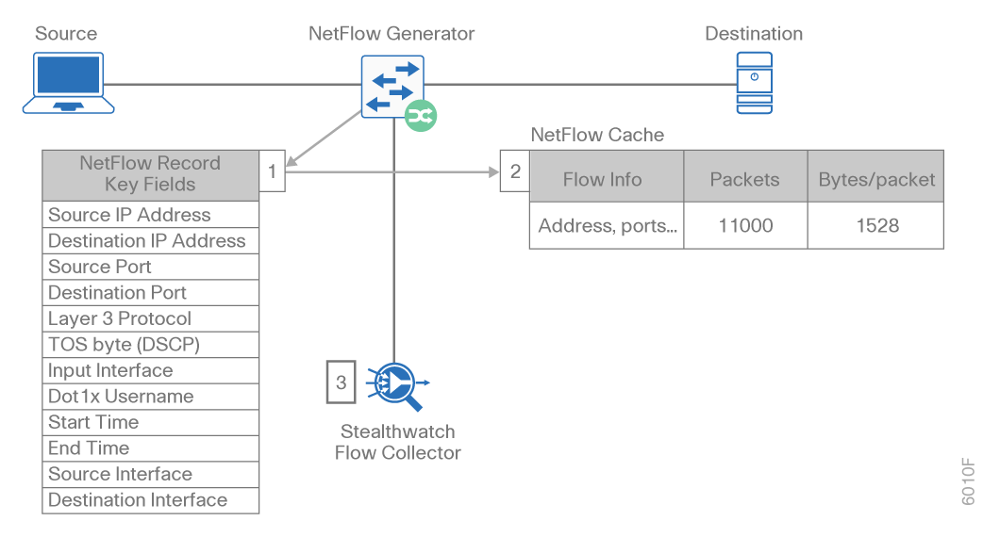
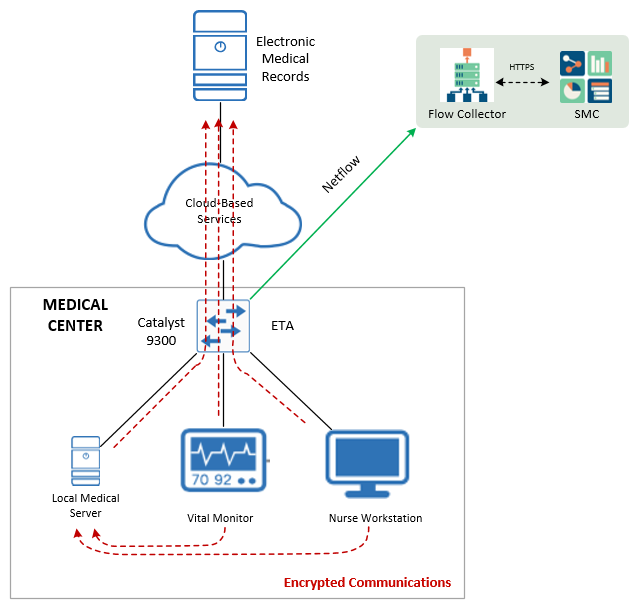
.. |image3| image:: media/image4.png
   :width: 4.74803in
   :height: 2.94373in
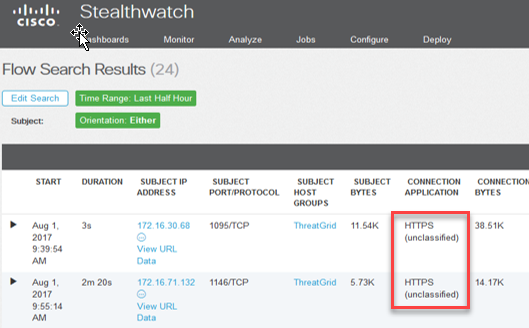
.. |image5| image:: media/image6.png
   :width: 4.74803in
   :height: 2.07273in
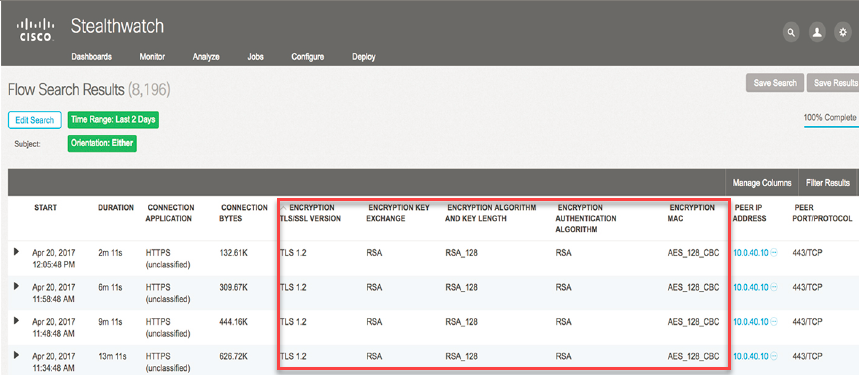
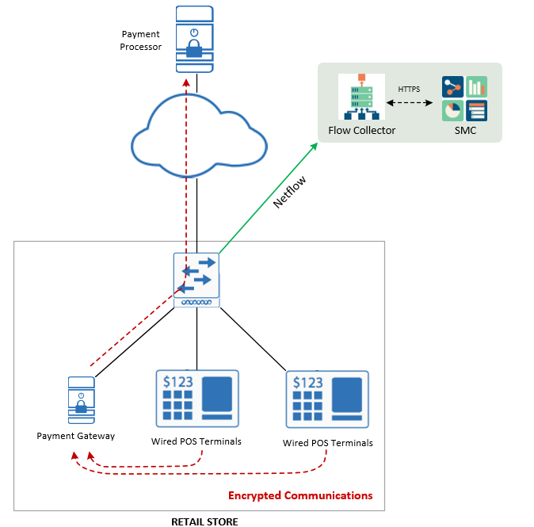
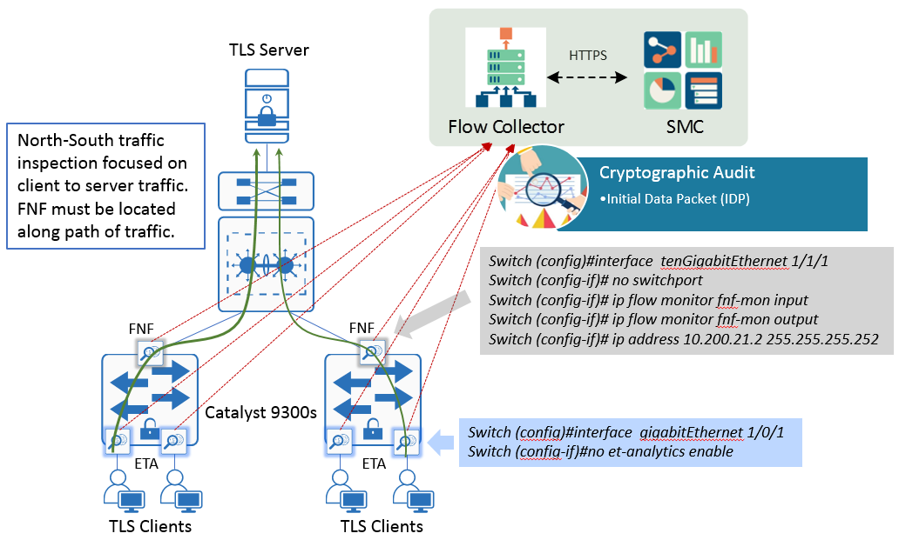
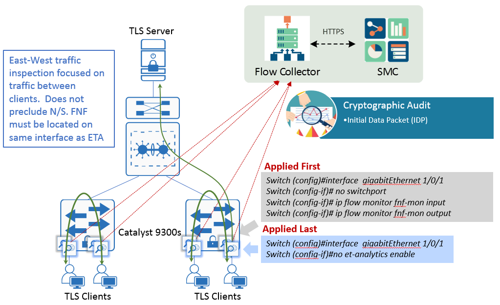
.. |image10| image:: media/image6.png
   :width: 4.74803in
   :height: 2.07273in
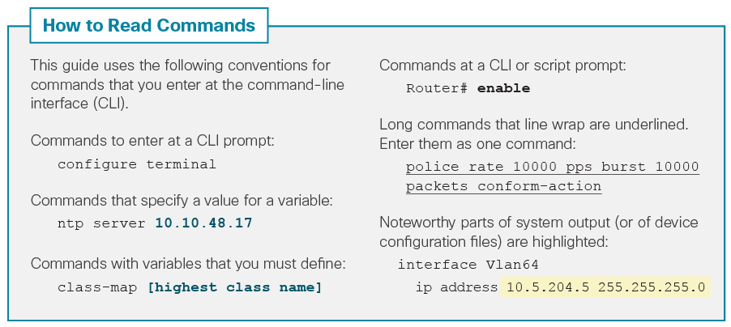
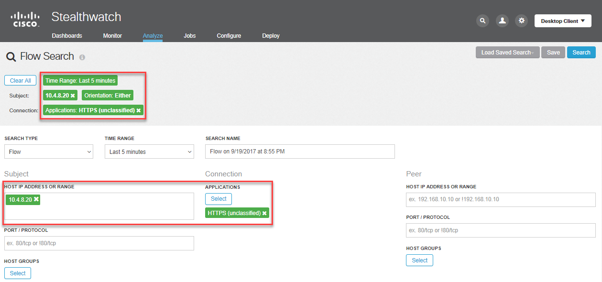
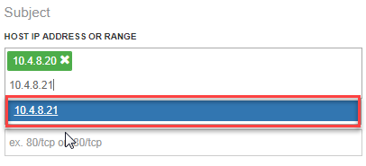
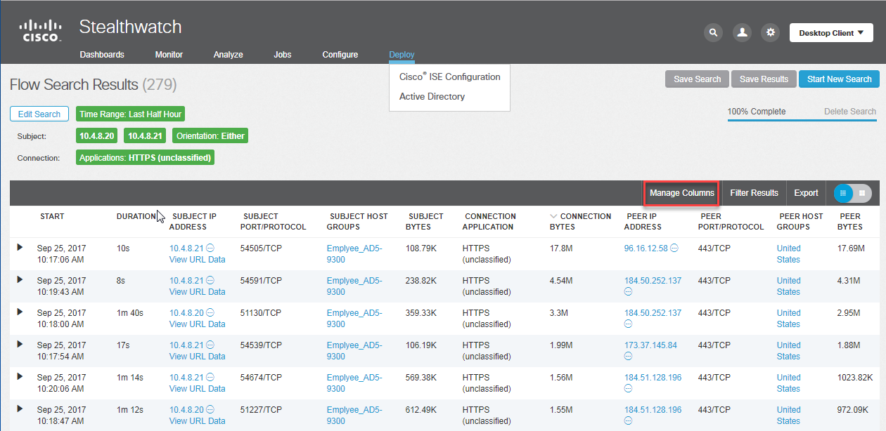
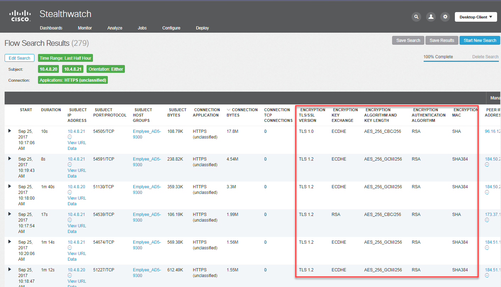
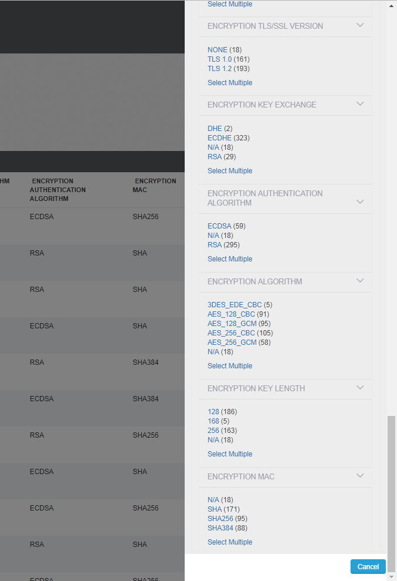
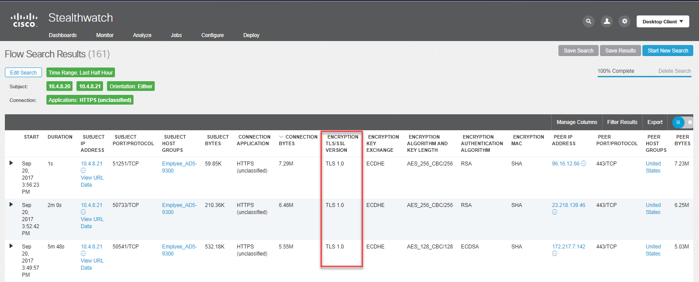
.. |C:\\Users\\jherman\\Desktop\\0001.png| image:: media/image19.png
   :width: 4.74803in
   :height: 2.12661in
.. |image19| image:: media/image20.png
   :width: 4.74803in
   :height: 0.81373in
.. |image20| image:: media/image21.png
   :width: 4.74803in
   :height: 1.96285in
.. |image21| image:: media/image22.png
   :width: 4.74803in
   :height: 1.42483in
.. |image22| image:: media/image23.png
   :width: 4.74803in
   :height: 1.95679in
.. |image23| image:: media/image24.png
   :width: 4.74803in
   :height: 2.35469in
.. |image24| image:: media/image25.png
   :width: 3.11419in
   :height: 1.99975in
.. |image25| image:: media/image26.png
   :width: 4.74803in
   :height: 0.72861in
.. |image26| image:: media/image27.png
   :width: 4.74803in
   :height: 1.04218in
.. |image27| image:: media/image28.png
   :width: 4.74803in
   :height: 0.61625in
.. |image28| image:: media/image29.png
   :width: 4.74803in
   :height: 2.73003in
.. |image29| image:: media/image30.png
   :width: 4.74803in
   :height: 2.87298in
.. |A screenshot of a computer screen Description generated with very high confidence| image:: media/image31.png
   :width: 4.74803in
   :height: 2.22505in
.. |image31| image:: media/image32.png
   :width: 4.22864in
   :height: 1.92684in
.. |A screenshot of a cell phone Description generated with very high confidence| image:: media/image33.png
   :width: 4.74803in
   :height: 2.76684in
.. |image33| image:: media/image34.png
   :width: 4.74803in
   :height: 2.22490in
.. |image34| image:: media/image35.png
   :width: 4.74803in
   :height: 2.31359in
.. |image35| image:: media/image36.png
   :width: 4.74803in
   :height: 2.37389in
.. |image36| image:: media/image37.png
   :width: 4.74803in
   :height: 2.71694in
.. |image37| image:: media/image38.png
   :width: 4.74803in
   :height: 3.19522in
.. |A screenshot of a computer Description generated with very high confidence| image:: media/image39.png
   :width: 4.74803in
   :height: 6.95675in
.. |A screenshot of a computer screen Description generated with very high confidence| image:: media/image40.png
   :width: 4.74803in
   :height: 1.91903in
.. |image40| image:: media/image41.png
   :width: 4.74803in
   :height: 3.19930in
.. |image41| image:: media/image42.png
   :width: 4.74803in
   :height: 1.24811in
.. |image42| image:: media/image43.png
   :width: 4.74803in
   :height: 3.70096in
.. |image43| image:: media/image44.png
   :width: 4.74803in
   :height: 2.45433in
.. |image44| image:: media/image45.png
   :width: 4.74803in
   :height: 1.58395in
.. |image45| image:: media/image46.png
   :width: 4.74803in
   :height: 5.79869in
.. |image46| image:: media/image47.png
   :width: 4.74803in
   :height: 1.58395in
.. |image47| image:: media/image48.png
   :width: 4.74803in
   :height: 2.48859in
.. |image48| image:: media/image49.png
   :width: 4.74803in
   :height: 2.46655in
.. |image49| image:: media/image50.png
   :width: 2.04604in
   :height: 7.27559in
